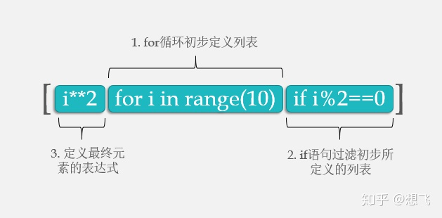

# 列表推导式

语法：



循环可以用来生成列表：


```python
values = [10, 21, 4, 7, 12]
squares = []
for x in values:
    squares.append(x**2)
print squares
```

    [100, 441, 16, 49, 144]


列表推导式可以使用更简单的方法来创建这个列表：


```python
values = [10, 21, 4, 7, 12]
squares = [x**2 for x in values]
print squares
```

    [100, 441, 16, 49, 144]

> 关于什么时候能用**列表推导式**，你就记住：列表推导式生成的是一个列表

还可以在列表推导式中加入条件进行筛选。

例如在上面的例子中，假如只想保留列表中不大于`10`的数的平方：


```python
values = [10, 21, 4, 7, 12]
squares = [x**2 for x in values if x <= 10]
print squares
```

    [100, 16, 49]


也可以使用推导式生成集合和字典：


```python
square_set = {x**2 for x in values if x <= 10}
print(square_set)
square_dict = {x: x**2 for x in values if x <= 10}
print(square_dict)
```

    set([16, 49, 100])
    {10: 100, 4: 16, 7: 49}


再如，计算上面例子中生成的列表中所有元素的和：


```python
total = sum([x**2 for x in values if x <= 10])
print(total)
```

    165


但是，**Python**会生成这个列表，然后在将它放到垃圾回收机制中（因为没有变量指向它），这毫无疑问是种浪费。

为了解决这种问题，与xrange()类似，**Python**使用产生式表达式来解决这个问题：


```python
total = sum(x**2 for x in values if x <= 10)
print(total)
```

    165


与上面相比，只是去掉了括号，但这里并不会一次性的生成这个列表。

比较一下两者的用时：


```python
x = range(1000000)
```


```python
%timeit total = sum([i**2 for i in x])
```

    1 loops, best of 3: 3.86 s per loop


```python
%timeit total = sum(i**2 for i in x)
```

    1 loops, best of 3: 2.58 s per loop


# 推导式

Python 推导式是一种独特的数据处理方式，可以从一个数据序列构建另一个新的数据序列的结构体。

Python 支持各种数据结构的推导式：

- 列表(list)推导式
- 字典(dict)推导式
- 集合(set)推导式
- 元组(tuple)推导式

## 列表推导式

列表推导式格式为：

```
[表达式 for 变量 in 列表] 
[out_exp_res for out_exp in input_list]

或者 

[表达式 for 变量 in 列表 if 条件]
[out_exp_res for out_exp in input_list if condition]
```

- out_exp_res：列表生成元素表达式，可以是有返回值的函数。
- for out_exp in input_list：迭代 input_list 将 out_exp 传入到 out_exp_res 表达式中。
- if condition：条件语句，可以过滤列表中不符合条件的值。

示例：

过滤掉长度小于或等于3的字符串列表，并将剩下的转换成大写字母：

```python
>>> names = ['Bob','Tom','alice','Jerry','Wendy','Smith']
>>> new_names = [name.upper() for name in names if len(name) > 3]
>>> print(new_names)
['ALICE', 'JERRY', 'WENDY', 'SMITH']
```

计算 30 以内（这里的写法是 $[0, 30)$ 的意思）可以被 3 整除的整数：

```python
>>> multiples = [i for i in range(30) if i % 3 == 0]
>>> print(multiples)
[0, 3, 6, 9, 12, 15, 18, 21, 24, 27]
```

## 字典推导式

字典推导基本格式：

```
{ key_expr: value_expr for value in collection }
或
{ key_expr: value_expr for value in collection if condition }
```

使用字符串及其长度创建字典：

```python
listdemo = ['Google','Runoob', 'Taobao']
# 将列表中各字符串值为键，各字符串的长度为值，组成键值对
>>> newdict = {key : len(key) for key in listdemo}
>>> newdict
{'Google': 6, 'Runoob': 6, 'Taobao': 6}
```

提供三个数字，以三个数字为键，三个数字的平方为值来创建字典：

```python
>>> dic = {x: x**2 for x in (2, 4, 6)}
>>> dic
{2: 4, 4: 16, 6: 36}
>>> type(dic)
<class 'dict'>
```

## 集合推导式

集合推导式基本格式：

```
{ expression for item in Sequence }
或
{ expression for item in Sequence if conditional }
```

计算数字 1,2,3 的平方数：

```python
>>> setnew = {i**2 for i in (1,2,3)}
>>> setnew
{1, 4, 9}
```

判断不是 abc 的字母并输出：

```python
>>> a = {x for x in 'abracadabra' if x not in 'abc'}
>>> a
{'d', 'r'}
>>> type(a)
<class 'set'>
```

## 元组推导式（生成器表达式）

元组推导式可以利用 range 区间、元组、列表、字典和集合等数据类型，快速生成一个满足指定需求的元组。

元组推导式基本格式：

```
(expression for item in Sequence )
或
(expression for item in Sequence if conditional )
```

元组推导式和列表推导式的用法也完全相同，只是元组推导式是用 **( )** 圆括号将各部分括起来，而列表推导式用的是中括号 **[ ]**，另外元组推导式返回的结果是一个**生成器对象**。

例如，我们可以使用下面的代码生成一个包含数字 1~9 的元组：

```python
>>> a = (x for x in range(1,10))
>>> a
<generator object <genexpr> at 0x7faf6ee20a50>  # 返回的是生成器对象

>>> tuple(a)       # 使用 tuple() 函数，可以直接将生成器对象转换成元组
(1, 2, 3, 4, 5, 6, 7, 8, 9)
```


# 还能这么用

## 1

语法格式：

```
结果值1 if 判断条件 else 结果2  for 变量名 in 原列表
```

```python
list1 = ['python', 'test1', 'test2']
list2 = [word.title() if word.startswith('p') else word.upper() for word in list1]
print(list2)
```

输出结果：

```
['Python', 'TEST1', 'TEST2']
```

解释：

这段代码是一个列表推导式（List Comprehension）的例子。

列表推导式是一种简洁的语法，用于根据已有列表生成新的列表。它由三个部分组成：

1. 表达式部分：`word.title() if word.startswith('p') else word.upper()`。**这是一个条件表达式**，用于根据条件选择执行不同的操作。
   - 如果 `word` 以字母 `'p'` 开头，则**使用 `word.title()` 将单词首字母大写，其余字母小写**。
   - 否则，**使用 `word.upper()` 将整个单词转换为大写**。

2. 迭代部分：`for word in list1`。这是对 `list1` 进行迭代，依次取出每个元素赋值给变量 `word`。

3. 待生成列表的原始数据来源：`list1`。这是我们希望根据哪个列表生成新的列表。

根据以上三个部分，整个列表推导式的作用是将 `list1` 中的每个元素进行处理，并根据条件输出相应的结果，最终形成一个新的列表 `list2`。

在给定的代码中，根据条件判断，如果单词以字母 `'p'` 开头，那么该单词会被处理成首字母大写，其余字母小写；否则，整个单词都被转换为大写。

因此，对于输入的 `list1` = `['python', 'test1', 'test2']`，代码的输出结果会是 `list2` = `['Python', 'TEST1', 'TEST2']`。


### Python条件表达式

> 条件表达式是一种简洁的语法结构，用于根据条件选择不同的值或执行不同的操作。它的一般形式是：
>
> ```python
> value_if_true if condition else value_if_false
> ```
>
> 其中：
> - `condition` 是一个布尔表达式，用于判断条件是否满足。
> - `value_if_true` 是在条件为真（True）时的返回值。
> - `value_if_false` 是在条件为假（False）时的返回值。
>
> 条件表达式可以看作是一种简化版的 `if-else` 语句，通过一行代码就能实现条件判断和结果返回。它在处理简单的条件逻辑时非常便捷，同时也比较易读。
>
> 下面是一个简单的例子来说明条件表达式的使用：
>
> ```python
> x = 10
> y = "Positive" if x > 0 else "Negative or Zero"
> print(y)
> ```
>
> 在上述代码中，`x` 的值为 10。条件表达式 `x > 0` 判断 `x` 是否大于 0。如果条件为真，即 `x` 大于 0，那么表达式的返回值是字符串 `"Positive"`；否则，表达式的返回值是字符串 `"Negative or Zero"`。最终，变量 `y` 被赋值为条件表达式的返回值，并打印输出。
>
> 需要注意的是，条件表达式并不适合复杂的逻辑判断和多个操作的场景。在这种情况下，通常会使用传统的 `if-else` 结构来提高可读性和灵活性。
>
> 
>
> 条件表达式在 Python 中的语法结构和 C++ 中的三元运算符 "? :" 是类似的。
>
> 在 Python 中，条件表达式的一般形式是：
>
> ```python
> value_if_true if condition else value_if_false
> ```
>
> 而在 C++ 中，三元运算符的一般形式是：
>
> ```cpp
> condition ? value_if_true : value_if_false
> ```
>
> 两者都是根据条件进行判断，并返回不同的值。它们的基本使用方式和含义是相同的。
>
> 以下是一个示例来对比介绍：
>
> Python 示例：
> ```python
> x = 10
> y = "Positive" if x > 0 else "Negative or Zero"
> print(y)
> ```
>
> C++ 示例：
> ```cpp
> int x = 10;
> std::string y = (x > 0) ? "Positive" : "Negative or Zero";
> std::cout << y << std::endl;
> ```
>
> 需要注意的是，**Python 的条件表达式可以用于更广泛的情况，不仅限于值的赋值，还可以作为表达式的一部分使用**，甚至可以嵌套使用。
>


