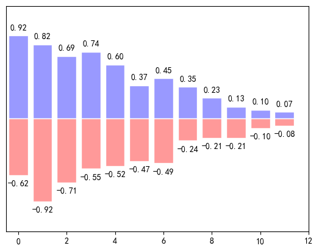

### 导包

先导入`matplotlib.pyplot`包，还要处理中文乱码问题。


```python
import matplotlib.pyplot as plt
import numpy as np
"""解决中文乱码问题"""
plt.rcParams["font.sans-serif"]=["SimHei"] #设置字体
plt.rcParams["axes.unicode_minus"]=False #该语句解决图像中的“-”负号的乱码问题
```

### plo.show()

关于使用`plo.show()`的问题：

1、在jupyter notebook中

2、因为可能你要对图表进行多种的描述，所以通过显式的调用show()可以避免不必要的错误。

### plt.plot() 函数

`plt.plot()` 函数用于绘制线条或散点图，它的常用参数包括：

- `x`：横坐标数据。可以是一个列表、数组或者其他可迭代对象，表示线条或散点图在横轴上的数据点位置。

- `y`：纵坐标数据。可以是一个列表、数组或者其他可迭代对象，表示线条或散点图在纵轴上的数据点位置。

- `fmt`：线条或散点图的样式字符串。注意：**不能写`fmt = 'b'`，`fmt`识别不了。** 可选参数，默认值为 None。样式字符串由颜色字符、线型字符和标记字符组成，例如 "b--" 表示蓝色虚线。下面是一些常用的样式字符串：
  - 颜色字符：'b'（蓝色）、'g'（绿色）、'r'（红色）、'c'（青色）、'm'（洋红）、'y'（黄色）、'k'（黑色）、'w'（白色）。
  - 线型字符：'-'（实线）、'--'（虚线）、'-.'（点划线）、':'（点线）。
  - 标记字符：'.'（点）、','（像素）、'o'（圆圈）、's'（正方形）、'^'（向上三角形）等。

- `color`：线条或散点图的颜色。可选参数，默认值为 None。可以使用命名颜色（如 "red"）、RGB 元组（如 (0.1, 0.2, 0.3)）或者 HTML 颜色字符串（如 "#FF0000"）来指定颜色。

- `linestyle`：线条的样式。可选参数，默认值为 None。可以使用线型字符（如 '-'、'--'、'-.'、':'）来指定线条的样式。

- `marker`：散点图的标记样式。可选参数，默认值为 None。可以使用标记字符（如 '.'、'o'、's'、'^'）来指定散点图的标记样式。

- `markersize`：散点图标记的大小。可选参数，默认值为 None。用于设置散点图中标记的尺寸大小。

- `label`：线条或散点图的标签。可选参数，默认值为 None。用于给线条或散点图添加标签，在绘制图例时使用。

- `linewidth`：线宽。

- 其他参数：除了上述常用参数外，还可以通过传递其他参数来控制线条或散点图的属性，如 linewidth（线宽）、alpha（透明度）、zorder（绘图顺序）等。

下面是一个示例：


```python
x = [1, 2, 3, 4, 5]
y = [1, 4, 9, 16, 25]

plt.plot(x, y, 'bo-', linewidth=2, markersize=8, label='Data')
plt.xlabel('X轴')
plt.ylabel('Y轴')
plt.title('Plot Example')
plt.legend()  # 添加图例

plt.show()
```


    


在上述示例中，我们使用了 x 和 y 作为横纵坐标数据，在 plt.plot() 中设置了样式字符串 'bo-' 表示蓝色圆圈连接线条。通过传递其他参数来设置线宽、标记大小和添加标签等。

> 更详细的可以看这里：https://tefuirnever.blog.csdn.net/article/details/99672296#comments_26325767

用`zorder`控制画图顺序：


```python
x = np.linspace(-3,3,50)
y1 = 0.1*x
y2 = x**2

plt.figure()
#zorder控制绘图顺序
plt.plot(x,y1,linewidth = 10,zorder = 2,label = r'$y_1\ =\ 0.1*x$')
plt.plot(x,y2,linewidth = 10,zorder = 1,label = r'$y_2\ =\ x^{2}$')

plt.legend(loc = 'best')

plt.show()
```


    


```python
x = np.linspace(-3,3,50)
y1 = 0.1*x
y2 = x**2

plt.figure()
#zorder控制绘图顺序
plt.plot(x,y1,linewidth = 10,zorder = 1,label = r'$y_1\ =\ 0.1*x$')
plt.plot(x,y2,linewidth = 10,zorder = 2,label = r'$y_2\ =\ x^{2}$')

plt.legend(loc = 'best')

plt.show()
```


    


### 设置坐标轴


`plt.xticks()` 和 `plt.yticks()` 是 matplotlib 中用于设置刻度标签的函数，分别作用于 x 轴和 y 轴。

这两个函数可以用来自定义坐标轴上的刻度位置和标签文本，以及刻度的显示样式。

`plt.xticks()` 的常用参数如下：
- `ticks`：用于指定刻度位置的数组。可以是一个数字序列，也可以是一个列表。例如，`ticks=[0, 1, 2, 3]`。
- `labels`：用于指定刻度标签的数组，与 `ticks` 参数对应。可以是一个字符串序列，也可以是一个列表。例如，`labels=['A', 'B', 'C', 'D']`。
- `rotation`：旋转刻度标签的角度。正值表示顺时针旋转，负值表示逆时针旋转。

`plt.yticks()` 的常用参数与 `plt.xticks()` 类似，可以设置刻度位置、标签和标签旋转角度。

下面是一个示例代码，展示了如何使用 `plt.xticks()` 和 `plt.yticks()` 自定义刻度标签：


```python
x = [1, 2, 3, 4, 5]
y = [1, 4, 9, 16, 25]

plt.plot(x, y)

# 设置 x 轴刻度
ticks_x = [1, 2, 3, 4, 5]  # x轴每格的值
labels_x = ['A', 'B', 'C', 'D', 'E']  # x轴每格写的啥
plt.xticks(ticks_x, labels_x)

# 设置 y 轴刻度
ticks_y = [0, 5, 10, 15, 20, 25]
labels_y = ['zero', 'five', 'ten', 'fifteen', 'twenty', 'twenty-five']
plt.yticks(ticks_y, labels_y, rotation=45)  # 旋转45度

plt.show()
```


    


在上述代码中，通过 `plt.plot()` 函数绘制了一条曲线。然后使用 `plt.xticks()` 设置 x 轴的刻度位置和标签文本，`ticks_x` 参数指定刻度位置为 `[1, 2, 3, 4, 5]`，`labels_x` 参数指定标签文本为 `['A', 'B', 'C', 'D', 'E']`。使用 `plt.yticks()` 设置 y 轴的刻度位置和标签文本，`ticks_y` 参数指定刻度位置为 `[0, 5, 10, 15, 20, 25]`，`labels_y` 参数指定标签文本为 `['zero', 'five', 'ten', 'fifteen', 'twenty', 'twenty-five']`，`rotation` 参数设为 45，表示刻度标签逆时针旋转45度。

最后使用 `plt.show()` 显示图形，包含了自定义刻度标签的曲线和坐标轴。

直接设置在图表上显示x，y的取值范围：


```python
x = np.linspace(-1,1,50)
y = x * 2

#在plt.show()之前添加
plt.xlim((0,2))
plt.ylim((-2,2))

plt.plot(x,y,color='green',linewidth = 3)
plt.show()
```


    


改坐标轴的代码，抄的这里：https://zhuanlan.zhihu.com/p/110976210


```python
n = np.linspace(-5, 4, 30)
m1 = 3 * n + 2
m2 = n ** 2

plt.plot(n, m1, 'r-.', n, m2, 'b')

plt.xlim((-2, 4))
plt.ylim((-5, 15))

# x_ticks = np.linspace(-5, 4, 10)
# plt.xticks(x_ticks)

# plt.yticks([-2.5, 7.5], ['hate','love'])

plt.xlabel('X轴')
plt.ylabel('Y轴')

ax = plt.gca()

ax.xaxis.set_ticks_position('bottom')
ax.spines['bottom'].set_position(('data',0))

ax.yaxis.set_ticks_position('left')
ax.spines['left'].set_position(('data',0))

ax.spines['top'].set_color('none')
ax.spines['right'].set_color('none')

plt.show()
```


    


### 图例

简单的使用：

第一步：给plt.plot( )中参数label=''传入字符串类型的值，也就是图例的名称

第二步：使用plt.legend( )使上述代码产生效果


```python
l1, = plt.plot(n, m1, label='蓝色线条')
l2, = plt.plot(n, m2, color='red', linewidth=1.0, linestyle='--', label='红色线条')

#简单的设置legend(设置位置)
#位置在右上角
plt.legend(loc = 'upper right')
```


    <matplotlib.legend.Legend at 0x21157667d60>


    


plt.legend( )中有handles、labels、loc、shadow 四个参数，其中：

- handles需要传入你所画线条的实例对象；

- labels是图例的名称（能够覆盖在plt.plot( )中label参数值），如果我们没有在legend方法的参数中设置labels，那么就会使用画线的时候，也就是plot方法中的指定的label参数所指定的名称，当然如果都没有的话就会抛出异常；

- loc代表了图例在整个坐标轴平面中的位置（一般选取'best'这个参数值）

- shadow = True 设置图例是否有阴影

详细的图例的位置可以参考上面的文章。

上述代码中，可以看到，若要plt.legend( )中的参数handels要想获取线条图像的实例，必须要用类似于 line1, = plt.plot( ) 这种写法，关于这个逗号：

稍作解释，plt.plot( )返回的是一个二元组值，若要获取实例，必须用x, = plt.plot( )才能取出来实例对象。还有，handles和labels传入的值必须一一对应，要不然图例就乱了。

> 更多内容看：
>
> https://zhuanlan.zhihu.com/p/33270402
>
> https://zhuanlan.zhihu.com/p/111108841

### 标注

从这里复制：https://blog.csdn.net/TeFuirnever/article/details/88946088


`plt.annotate()` 是 matplotlib 中用于添加注释的函数。它可以在图表中的指定位置添加文本注释，并可选择性地使用箭头连接到被注释的点。

`plt.annotate()` 函数的语法如下：
```python
plt.annotate(text, xy, xytext, arrowprops, **kwargs)
```

下面是该函数的各个参数的详细介绍：
- `text`：要显示的文本内容。
- `xy`：被注释点的坐标（x, y）。接受一个元组。
- `xytext`：文本注释的坐标（x, y）。如果不指定该参数，则默认与 `xy` 相同。
- `arrowprops`：箭头属性的字典或可选关键字参数，用于定义箭头的样式（可选）。常用的箭头属性包括：
    - `arrowstyle`：箭头风格，默认为 `'->'`。
    - `connectionstyle`：连接线的风格，默认为 `'arc3'`。
    - `color`：箭头和连接线的颜色。
    - `linewidth`：箭头和连接线的线宽。
    - `shrink`：收缩箭头的长度，取值范围为 [0, 1]。
    - `relpos`：传入一个元组 (dx, dy)，表示箭头相对于注释点的偏移量。
- `**kwargs`：其他可选参数，例如设置字体、文本框的背景色等。

除了这些参数，`plt.annotate()` 函数还可以接受一些常用的文本处理参数，例如设置字体大小、颜色、对齐方式等。这些参数可以通过 `fontsize`、`color`、`ha`（水平对齐）、`va`（垂直对齐）等关键字参数进行设置。

下面是一个示例代码，展示了如何使用 `plt.annotate()` 函数在图表中添加注释：


```python
x = [1, 2, 3]
y = [2, 4, 6]

plt.plot(x, y)
plt.scatter(x, y)

# 添加注释
plt.annotate('Point', xy=(2.02, 4), xytext=(2.5, 3.5),
             arrowprops={'arrowstyle': '->', 'connectionstyle': 'arc3', 'color': 'blue'},
             fontsize=12, color='red')

plt.show()
```


    


在上述代码中，**首先使用 plt.plot() 绘制了一条线，并使用 plt.scatter() 绘制了散点图。** 然后，通过 plt.annotate() 函数在 (2, 4) 的位置添加了一个注释。注释内容为 'Point'，注释文本的位置为 (2.5, 3.5)。箭头样式由箭头属性字典定义，字体大小为 12，颜色为红色。

通过调整注释函数的各个参数，您可以根据需要在图表中添加具有不同样式和位置的注释。


再看几个例子：


```python
x = np.arange(0, 6)
y = x * x

plt.plot(x, y, marker='o')

for xy in zip(x, y):
    plt.annotate("(%s,%s)" % xy, xy=xy, xytext=(-20, 10), textcoords='offset points')
plt.show()
```


    


```python
x = np.linspace(-3,3,50)
y = 2*x + 1

plt.figure(num = 1,figsize =(8,5))
plt.plot(x,y)

ax = plt.gca()
ax.spines['right'].set_color('none')
ax.spines['top'].set_color('none')

#将底下的作为x轴
ax.xaxis.set_ticks_position('bottom')
#并且data，以y轴的数据为基本
ax.spines['bottom'].set_position(('data',0))

#将左边的作为y轴
ax.yaxis.set_ticks_position('left')
ax.spines['left'].set_position(('data',0))

x0 = 1
y0 = 2*x0 + 1
plt.plot([x0,x0],[0,y0],'k--',linewidth = 1.0)  # 黑色虚线
plt.scatter([x0],[y0],s = 50,color='b')  # 一个蓝色散点

plt.annotate(r'$2x+1 = %s$'% y0,xy = (x0,y0),xycoords = 'data',
             xytext=(+30,-30),textcoords = 'offset points',fontsize = 16
             ,arrowprops = dict(arrowstyle='->',
                                connectionstyle="arc3,rad=.2"))

plt.show()
```


    


```python
plt.annotate(r'$2x+1 = %s$'% y0,xy = (x0,y0),xycoords = 'data',
             xytext=(+30,-30),textcoords = 'offset points',fontsize = 16
             ,arrowprops = dict(arrowstyle='->',
                                connectionstyle="arc3,rad=.2"))
```

注意：

- xy就是需要进行注释的点的横纵坐标；
- xycoords = 'data'说明的是要注释点的xy的坐标是以横纵坐标轴为基准的；
- xytext=(+30,-30)和textcoords='data'说明了这里的文字是基于标注的点的x坐标的偏移+30以及标注点y坐标-30位置，就是我们要进行注释文字的位置；
- fontsize = 16就说明字体的大小；
- arrowprops = dict()这个是对于这个箭头的描述，arrowstyle='->'这个是箭头的类型，connectionstyle="arc3,rad=.2"这两个是描述我们的箭头的弧度以及角度的。


解释1：

在 `plt.scatter([x0], [y0], s=50, color='b')` 中，`plt.scatter()` 函数用于绘制散点图。

该函数的参数含义如下：

`[x0]`：横坐标列表，表示每个散点的横坐标位置。
`[y0]`：纵坐标列表，表示每个散点的纵坐标位置。
`s=50`：散点的大小（尺寸）参数，默认值为 20。这里的 s=50 表示散点的大小为 50。
`color='b'`：散点的颜色参数，默认值为 'b'，表示蓝色。这里的 color='b' 表示散点的颜色为蓝色。
因此，`plt.scatter([x0], [y0], s=50, color='b')` 的含义是绘制一个具有单个散点的散点图，散点的横坐标为 x0，纵坐标为 y0，散点大小为 50，颜色为蓝色。

解释2：

`textcoords` 是 `plt.annotate()` 函数的一个可选参数，用于指定文本注释坐标的参考系统。

`textcoords` 参数有以下几种可选值：
- `'offset points'`：以偏移量（以点为单位）来表示文本注释的坐标。在这种参考系统下，`xytext` 参数指定的坐标表示相对于被注释点的偏移量。
- `'offset pixels'`：以偏移量（以像素为单位）来表示文本注释的坐标。在这种参考系统下，`xytext` 参数指定的坐标表示相对于被注释点的偏移量。
- `'figure points'`：以图形坐标系中的点为单位来表示文本注释的坐标。在这种参考系统下，`xytext` 参数指定的坐标表示图形左下角为原点的坐标。
- `'figure fraction'`：以图形坐标系中的百分比表示文本注释的坐标。在这种参考系统下，`xytext` 参数指定的坐标表示相对于图形大小的百分比坐标。
- `'axes points'`：以轴坐标系中的点为单位来表示文本注释的坐标。在这种参考系统下，`xytext` 参数指定的坐标表示轴左下角为原点的坐标。
- `'axes fraction'`：以轴坐标系中的百分比表示文本注释的坐标。在这种参考系统下，`xytext` 参数指定的坐标表示相对于轴大小的百分比坐标。

通过设置不同的 `textcoords` 值，可以灵活地控制文本注释的位置和坐标参考系统。例如，当使用 `'offset points'` 参考系统时，可以指定一个距离，使得文本注释相对于被注释点有固定的偏移量；而当使用 `'figure fraction'` 参考系统时，可以指定一个百分比坐标，使得文本注释相对于图形的位置保持一致，不受图形大小的影响。

下面是一个示例代码，演示了如何使用不同的 `textcoords` 值来指定文本注释的坐标参考系统：
```python
import matplotlib.pyplot as plt

x = [1, 2, 3]
y = [2, 4, 6]

plt.plot(x, y)
plt.scatter(x, y)

# 使用不同的 textcoords 参数添加注释
plt.annotate('Offset Points', xy=(2, 4), xytext=(10, 10),
             arrowprops={'arrowstyle': '->', 'connectionstyle': 'arc3', 'color': 'blue'},
             textcoords='offset points')
             
plt.annotate('Figure Fraction', xy=(2, 4), xytext=(0.5, 0.5),
             arrowprops={'arrowstyle': '->', 'connectionstyle': 'arc3', 'color': 'red'},
             textcoords='figure fraction')

plt.show()
```

在上述代码中，第一个注释使用 `'offset points'` 参考系统，并将 `(10, 10)` 视为注释文本的偏移量。第二个注释使用 `'figure fraction'` 参考系统，并将 `(0.5, 0.5)` 视为注释文本的百分比坐标。通过更改 `textcoords` 值，可以实现不

### 散点图

`plt.scatter()` 函数用于绘制散点图，它具有多个可选参数，下面我会详细介绍每个参数的含义和用法：

- `x`：表示散点的横坐标列表。
- `y`：表示散点的纵坐标列表。
- `s`：表示散点的大小（尺寸），可以是一个数值或与 `x`、`y` 长度相同的数组。默认值为 20。
- `c`：表示散点的颜色，可以是一个颜色字符串、颜色代码或与 `x`、`y` 长度相同的数组。默认值为 `'b'`，即蓝色。
- `marker`：表示散点的样式，默认值为 `'o'`，即圆圈。常用的取值包括 `'o'`、`'.'`、`'s'`、`'+'` 等，其它更多样式可以参考 Matplotlib 的文档。
- `alpha`：表示散点的透明度，取值范围为 0 到 1，0 表示完全透明，1 表示完全不透明。默认值为 1。
- `linewidths`：表示散点边界的线宽。
- `edgecolors`：表示散点边界的颜色。
- `cmap`：表示颜色映射，在指定了 `c` 参数为一组数值时生效。可以是一个颜色映射对象，也可以是一个以颜色名称为键、RGB 或 RGBA 值为值的字典。
- `norm`：在指定了 `cmap` 参数时，用于对 `c` 的值进行归一化的对象。
- `vmin` 和 `vmax`：在指定了 `c` 参数和 `norm` 参数时，用于设定颜色映射的值范围。
- `alpha`：表示散点的透明度，取值范围为 0 到 1，0 表示完全透明，1 表示完全不透明。默认值为 1。

除了上述参数，`plt.scatter()` 函数还有一些常用的参数，用于调整坐标轴、标题、图例等内容。例如：
- `xlabel` 和 `ylabel`：用于设置横纵坐标轴的标签。
- `title`：用于设置图表的标题。
- `legend`：用于显示图例。

这些参数可以根据具体需要来灵活使用，以获得所需的散点图效果。


```python
n = 1024
X = np.random.normal(0,1,n)
Y = np.random.normal(0,1,n)
T = np.arctan2(Y,X)#for color later on

plt.scatter(X,Y,s = 75,c = T,alpha = .5)

plt.xlim((-1.5,1.5))
plt.xticks([])#ignore xticks
plt.ylim((-1.5,1.5))
plt.yticks([])#ignore yticks
plt.show()
```


    


在这段代码中，T = np.arctan2(Y, X) 的作用是计算每个散点的极角。np.arctan2(Y, X) 是一个 NumPy 函数，它接受两个参数 Y 和 X，返回它们对应的反正切值。在数学上，反正切函数可以将笛卡尔坐标系中的一个点 (X, Y) 转换为极坐标系中的一个角度。

具体来说，当给定一个点的横坐标 X 和纵坐标 Y 时，通过计算 np.arctan2(Y, X)，会得到该点相对于原点 (0, 0) 所处的极角。结果的单位是弧度（radians），可以理解成点对应到极坐标系中的角度。

在代码中，T 这个变量代表了每个散点的极角。然后通过传递 T 给 plt.scatter() 函数的 c 参数，将散点的颜色与极角进行关联。这样就可以根据每个点的极角信息显示不同的颜色，在散点图中呈现出更多维度的信息。

在 `plt.scatter()` 函数中，`c` 参数用于设置散点的颜色。它可以接受多种不同的取值方式：

1. 单个颜色值: 可以传递一个单独的颜色值，例如字符串 `'red'`、`'blue'` 作为参数。
2. 颜色序列：可以传递一个与数据大小相同的颜色序列，例如一个列表或数组，用于指定每个散点的颜色。这样可以实现根据特定数据值来区分散点的颜色。例如，可以将一个列表 `[0, 1, 2, 3]` 传递给 `c` 参数，来代表散点的颜色。
3. 值-颜色映射：可以传递一个数值序列，并使用预定义的颜色映射函数（cmap）来将数值映射到颜色上。常见的颜色映射函数包括 `'viridis'`、`'jet'`、`'coolwarm'` 等。这种方式可以将数据的大小与对应的颜色进行关联，呈现出更直观的色彩变化。

在代码中，`T` 是一个表示极角的变量，通过将其传递给 `c` 参数，采用值-颜色映射的方式来设置散点的颜色。具体的颜色映射由 `cmap` 参数指定，默认为 `'viridis'`。根据 `T` 的值的不同，每个散点的颜色将在颜色映射中找到对应的颜色来表示。较小的极角对应于颜色映射中较浅的颜色，而较大的极角则对应于较深的颜色。这样就实现了根据极角信息设置散点的颜色。


```python
# 生成随机数据
np.random.seed(0)
n = 100
x = np.random.rand(n)
y = np.random.rand(n)
colors = np.random.rand(n)
sizes = 1000 * np.random.rand(n)

# 绘制散点图
plt.scatter(x, y, c=colors, s=sizes, alpha=0.5, cmap='viridis')

# 添加颜色条
plt.colorbar()

# 添加标签和标题
plt.xlabel('X-axis')
plt.ylabel('Y-axis')
plt.title('Scatter Plot Example')

# 设置坐标轴范围
plt.xlim(0, 1)
plt.ylim(0, 1)

# 显示图形
plt.show()
```


    


### 柱状图


```python
n = 12
X = np.arange(n)
Y1 = (1 - X/float(n)) * np.random.uniform(0.5,1.0,n)
Y2 = (1 - X/float(n)) * np.random.uniform(0.5,1.0,n)
#facecolor:表面的颜色;edgecolor:边框的颜色
plt.bar(X,+Y1,facecolor = '#9999ff',edgecolor = 'white')
plt.bar(X,-Y2,facecolor = '#ff9999',edgecolor = 'white')
#描绘text在图表上
# plt.text(0 + 0.4, 0 + 0.05,"huhu")
for x,y in zip(X,Y1):
    #ha : horizontal alignment
    #va : vertical alignment
    plt.text(x + 0.01,y+0.05,'%.2f'%y,ha = 'center',va='bottom')

for x,y in zip(X,Y2):
    # ha : horizontal alignment
    # va : vertical alignment
    plt.text(x+0.01,-y-0.05,'%.2f'%(-y),ha='center',va='top')

plt.xlim(-.5,n)
plt.yticks([])  # 将 y 轴的刻度标签禁用或隐藏
plt.ylim(-1.25,1.25)
plt.yticks([])  # 将 x 轴的刻度标签禁用或隐藏
plt.show()
```



    


### 等高线图


```python
# 定义一个函数f(x, y)，用于计算给定坐标点(x, y)的高度值
def f(x, y):
    return (1 - x/2 + x**5 + y**3) * np.exp(-x**2 - y**2)

# 设置绘图网格的分辨率为n x n
n = 256
x = np.linspace(-3, 3, n)
y = np.linspace(-3, 3, n)

# 生成网格数据，X和Y为二维数组，表示网格中每个点的x和y坐标
X, Y = np.meshgrid(x, y)

# 绘制等高线图，并使用'contourf'函数填充等高线内部的颜色
# f(X, Y)计算每个网格点的高度值，8表示等高线的数量，alpha是填充颜色的透明度，cmap是指定填充颜色的色图
plt.contourf(X, Y, f(X, Y), 8, alpha=0.75, cmap=plt.cm.hot)

# 绘制等高线，并使用黑色('black')表示线条颜色，linewidth设置线条宽度
C = plt.contour(X, Y, f(X, Y), 8, colors='black', linewidth=0.5)

# 在等高线上添加标签（高度值），inline=True表示将标签显示在等高线内部，fontsize设置标签的字体大小
plt.clabel(C, inline=True, fontsize=10)

# 隐藏x和y轴刻度
plt.xticks([])
plt.yticks([])

# 显示绘图结果
plt.show()

```

    C:\Users\ATRI\AppData\Local\Temp\ipykernel_115464\824593986.py:22: UserWarning: The following kwargs were not used by contour: 'linewidth'
      C = plt.contour(X, Y, f(X, Y), 8, colors='black', linewidth=0.5)


    


参数plt.contourf(X, Y, f(X, Y), 8, alpha=0.75, cmap=plt.cm.hot)的含义如下：

X和Y: 二维数组，表示网格中每个点的x和y坐标。通常通过np.meshgrid()函数生成，用于定义绘制等高线图的坐标网格。

f(X, Y): 二维数组，表示在网格坐标(X, Y)处计算得到的高度值。这些高度值将决定等高线图上每个点的颜色和高度。

8: 表示等高线的数量，即等高线的分层级别。这里设置为8，表示在等高线图上绘制8条等高线。

alpha=0.75: 设置等高线填充区域的透明度。这里设置为0.75，表示填充区域的颜色透明度为75%，让等高线图与背景稍微透明，以便看到一些底层的图形。

cmap=plt.cm.hot: 指定填充颜色的色图。plt.cm.hot是Matplotlib库中的一个预定义色图，它将较小的值映射为较浅的颜色，较大的值映射为较深的颜色，使得等高线图在高度变化上更加鲜明。你可以根据需要选择不同的色图，或者自定义色图。

综上所述，plt.contourf(X, Y, f(X, Y), 8, alpha=0.75, cmap=plt.cm.hot)这行代码会根据网格数据X和Y以及高度数据f(X, Y)绘制一个填充等高线图，使用8个等高线分层级别，并使用预定义的热色图(hot)来填充等高线内部。填充区域的颜色将根据高度值的不同而变化，透明度为0.75，以提高图形的可视化效果。

### 绘制多图合并展示

#### 使用subplot

plt.subplot(221)：221表示将画板划分为2行2列，然后取第1个区域。那么第几个区域是怎么界定的呢？这个规则遵循行优先数数规则！

图片

plt.subplot(212)表示将整个画板分成两部分后取第2块，即下面的部分。


```python
t=np.arange(0.0,2.0,0.1)
s=np.sin(t*np.pi)

plt.figure(figsize=(8,8), dpi=80)
plt.figure(1)

ax1 = plt.subplot(221)
plt.plot([1,2,3,4],[4,5,7,8], color="r",linestyle = "--")

ax2 = plt.subplot(222)
plt.plot([1,2,3,5],[2,3,5,7],color="y",linestyle = "-")

ax3 = plt.subplot(212)
plt.plot([1,2,3,4],[11,22,33,44],color="g",linestyle = "-.")
```


    [<matplotlib.lines.Line2D at 0x21159a611f0>]


    


`plt.figure(figsize=(8, 8), dpi=80)` 是 Matplotlib 中的函数，用于创建一个新的图形窗口并设置其尺寸和分辨率。

具体含义如下：

- `figsize=(8, 8)`：通过指定 figsize 参数，可以设置图形窗口的宽度和高度。这里 `(8, 8)` 表示窗口的宽度为 8 英寸，高度也为 8 英寸。可以根据需要调整这个值来控制图形窗口的大小。

- `dpi=80`：通过指定 dpi 参数，可以设置图形窗口的分辨率（每英寸像素点数）。这里 `dpi=80` 表示每英寸包含 80 个像素点。分辨率越高，图形会更加清晰，但也会占用更多的内存和计算资源。

综合起来，`plt.figure(figsize=(8, 8), dpi=80)` 这行代码的含义是在创建一个图形窗口时，将窗口的宽度和高度设置为 8 英寸，分辨率设为 80 像素/英寸。这样可以控制最终绘制出的图形窗口的大小和清晰度。根据实际需要，可以根据具体情况调整这些参数的取值。

#### 使用subplot2grid


`plt.subplot2grid((3,3),(0,0),colspan=3,rowspan=1)` 是 Matplotlib 中的函数，用于创建一个基于网格布局的子图。

具体含义如下：

- `plt.subplot2grid((3,3),(0,0),colspan=3,rowspan=1)`：通过调用 `subplot2grid()` 函数来创建子图。其中的参数依次为：
  - `(3,3)`：表示整个网格布局的行数和列数。这里 `(3,3)` 表示网格布局总共有 3 行和 3 列。
  - `(0,0)`：表示子图在网格中的起始位置的行索引和列索引。这里 `(0,0)` 表示子图位于第 1 行和第 1 列的位置。
  - `colspan=3`：表示子图跨越的列数，默认为 1。这里 `colspan=3` 表示子图横跨 3 列。
  - `rowspan=1`：表示子图跨越的行数，默认为 1。这里 `rowspan=1` 表示子图不跨越多行。

综合起来，`plt.subplot2grid((3,3),(0,0),colspan=3,rowspan=1)` 这行代码的含义是在一个由 3 行 3 列组成的网格布局中创建一个子图，使其位于第 1 行、第 1 列的位置，并且横跨 3 列、不跨越多行。

通过使用网格布局，你可以方便地将子图放置在指定位置，并控制子图横跨的列数和跨越的行数。这样可以灵活地布局多个子图，以满足不同的绘图需求。


```python
plt.figure(figsize=(12, 10), dpi=80)

ax1=plt.subplot2grid((3,3),(0,0),colspan=3,rowspan=1)  # 相当于格子分成3行3列,用3列，用1行
ax1.plot([1,2],[1,2])  # 轴的范围，x轴，y轴。 
ax1.set_title('图一')

ax2=plt.subplot2grid((3,3),(1,0),colspan=2,rowspan=1)
ax2.plot([2,4,6],[7,9,15])

ax3=plt.subplot2grid((3,3),(1,2),colspan=1,rowspan=1)
x = np.arange(4)
y = np.array([15,20,18,25])
ax3.bar(x,y)

ax4=plt.subplot2grid((3,3),(2,0),colspan=1,rowspan=1)

ax5=plt.subplot2grid((3,3),(2,1),colspan=2,rowspan=1)
```


    


#### 图中图


```python
fig = plt.figure()
x = [1,2,3,4,5,6,7]
y = [1,3,4,2,5,8,6]

#below are all percentage
left, bottom, width, height = 0.1, 0.1, 0.8, 0.8
#使用plt.figure()显示的是一个空的figure
#如果使用fig.add_axes会添加轴
ax1 = fig.add_axes([left, bottom, width, height])# main axes
ax1.plot(x,y,'r')
ax1.set_xlabel('x')
ax1.set_ylabel('y')
ax1.set_title('大图')

ax2 = fig.add_axes([0.2, 0.6, 0.25, 0.25])  # inside axes
ax2.plot(y, x, 'b')
ax2.set_xlabel('x')
ax2.set_ylabel('y')
ax2.set_title('小图1')

# different method to add axes
####################################
plt.axes([0.6, 0.2, 0.25, 0.25])
plt.plot(y[::-1], x, 'g')
plt.xlabel('x')
plt.ylabel('y')
plt.title('小图2')

plt.show()
```


    

