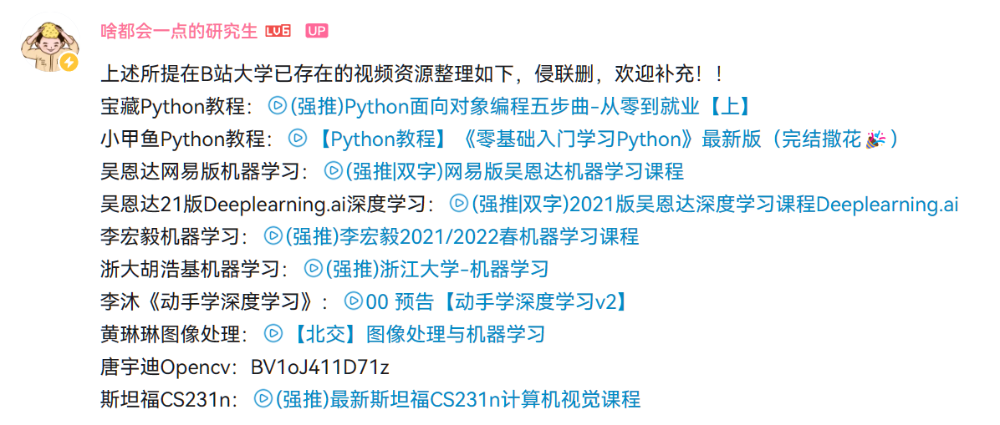
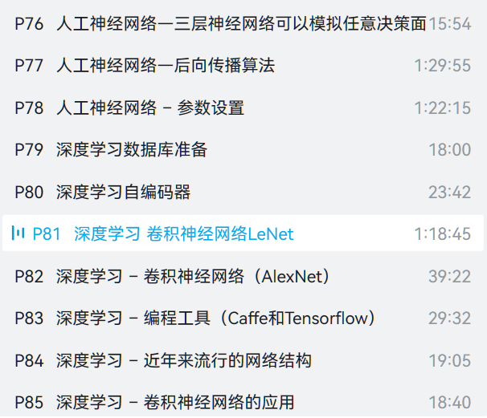

## 机器学习路线规划

[|AI学习路线分享|做完这些，你已经成为机器学习方面的专家\_哔哩哔哩_bilibili](https://www.bilibili.com/video/BV16341177c1/?vd_source=5ed8eb14651adefbf97fd6f8c41c1ca)

这个是路线的总规划，里面有网课推荐。

## 机器学习可以看

[(强推)李宏毅2021/2022春机器学习课程_哔哩哔哩_bilibili](https://www.bilibili.com/video/BV1Wv411h7kN/?spm_id_from=333.337.search-card.all.click&vd_source=5ed8eb14651ad8efbf97fd6f8c41c1ca)

[3.3 神经网络的Softmax输出_哔哩哔哩_bilibili](https://www.bilibili.com/video/BV1Pa411X76s/?p=67&spm_id_from=pageDriver&vd_source=5ed8eb14651ad8efbf97fd6f8c41c1ca)

[2.1 Dual Support Vector Machine - Motivation of Dual SVM_高清 720P_哔哩哔哩_bilibili](https://www.bilibili.com/video/BV1Mv411u7q1/?p=6&vd_source=5ed8eb14651ad8efbf97fd6f8c41c1ca)

台大林轩田老师

## 深度学习看这些

[(强推)浙江大学-机器学习：深度学习 卷积神经网络LeNet\_哔哩哔哩_bilibili](https://www.bilibili.com/video/BV1qf4y1x7kB/?p=81&vd_source=5ed8eb14651ad8efbf97fd6f8c41c1ca)

这个的理论讲得很好，从人工神经网络到卷积神经网络。看后面的比较好，讲得很细，前面的不太行。他还讲了svm，讲得也好。

[跟李沐学AI的个人空间\_哔哩哔哩_bilibili](https://space.bilibili.com/1567748478/channel/seriesdetail?sid=358497)

[7.1. 深度卷积神经网络（AlexNet） — 动手学深度学习 2.0.0 documentation (d2l.ai)](https://zh.d2l.ai/chapter_convolutional-modern/alexnet.html)

李沐的课很完整，他主要教你怎么写。

[3.2 使用pytorch搭建AlexNet并训练花分类数据集\_哔哩哔哩_bilibili](https://www.bilibili.com/video/BV1W7411T7qc/?spm_id_from=333.788&vd_source=5ed8eb14651ad8efbf97fd6f8c41c1ca)

这位更是重量级，直接手把手教你搭神经网络，模型、训练和预测的代码文件都给你了，直接改一改就可以自己用了。还有帮你给数据集分类的脚本，可以直接改一改然后用。

