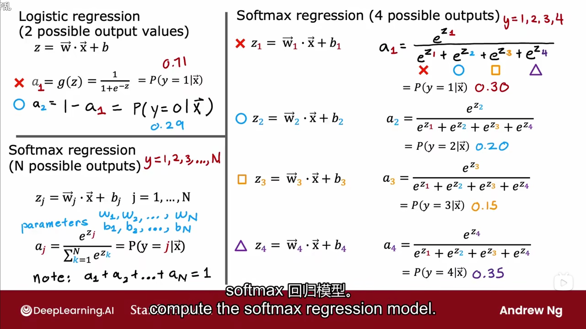
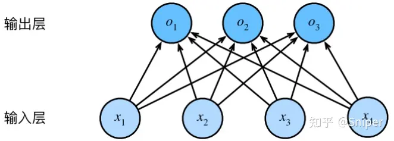
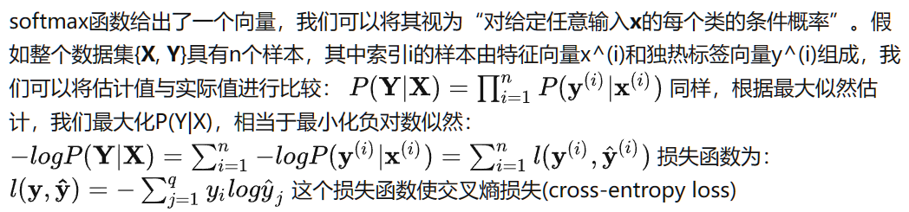
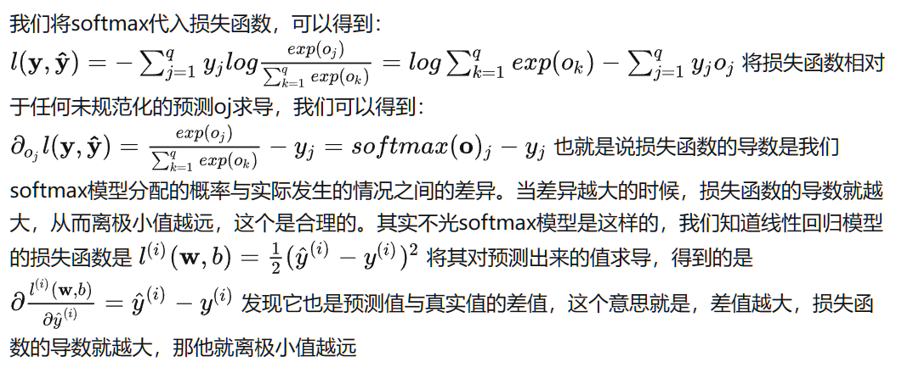

这个讲得很清楚：[softmax回归 - 知乎 (zhihu.com)](https://zhuanlan.zhihu.com/p/618886503)

### 分类问题

之前我们一直在说回归问题，它多用于预测，假如我们现在有一个问题是图像分类，我们要把猫，鸡，狗的图片进行区分。每次输入的是一个2×2的灰度图像，我们用一个标量表示每个像素值，每个图像对应四个特征x1，x2，x3，x4。接下来就是我们要选择如何来表示标签，最直接的想法就是选择y∈{1, 2, 3}，其中整数分别代表{狗，猫，鸡}。可是这个1，2，3就很奇怪，本来狗，猫，鸡就没有什么顺序，这样一排成1，2，3简直就是在告诉计算机说鸡最大，猫第二，狗最小。这样是不行的，但是有些问题如果有它的自然顺序，比如说{婴儿，儿童，青少年，青年人，中年人，老年人}，这样就还行，这个问题也就会转变为回归问题，这样用{1, 2, 3......}来表示还是比较有意义的。

对于一般的没有自然顺序的分类问题，我们可以用**独热编码(one-hot encoding)**来搞定，独热编码是一个向量，它的分量和类别一样多，类别对应的分量设置为1，其他所有分量设置为0.这样的话，(1, 0, 0)对应于“猫”，(0, 1, 0)对应于“鸡”，(0, 0, 1)对应于“狗”： y∈{(1,0,0),(0,1,0),(0,0,1)}

### 网络架构

对于分类问题，我们最后**输出的是一个样本对于所有种类的条件概率**，**其中概率最高的一个是我们的分类**。在我们上面的例子中，我们有4个特征和3个可能的输出类别，我们将需要12个标量来表示权重，3个标量来表示偏置，这样我们就得到了三个未规范化的预测(logit): o1, o2, o3 

$$
\begin{gathered}
o_{1} =x_1w_{11}+x_2w_{12}+x_3w_{13}+x_4w_{14}+b_1, \\
o_{2} =x_1w_{21}+x_2w_{22}+x_3w_{23}+x_4w_{24}+b_2, \\
o_{3} =x_1w_{31}+x_2w_{32}+x_3w_{33}+x_4w_{34}+b_3, 
\end{gathered}
$$
我们可以用神经网络图来描述这个计算过程，如下：

与线性回归一样，**softmax回归也是一个单层神经网络**，由于计算每个输出o1、o2、o3取决于所有输入x1、x2、x3和x4，所以softmax回归的输出层也是**全连接层**

### softmax运算

我们将选择具有最大概率的标签

**但是，输出的结果可能不是我们感兴趣的，因为预测出来的o1，o2和o3不一定总和一定是1，另一方面，根据输入的不同，它们可以为负值，这就严重违反了概率公理**

要将输出视为概率，我们必须保证在任何数据上的输出都是非负的且总和为1，此外我们还需要一个训练的目标函数，来激励模型精准地估计概率

softmax函数能够将未规范化的预测变换为非负数且总和为1，同时让模型保持可导的性质。为了完成这一个目标，我们首先对每个未规范化的预测求幂，这样可以确保输出非负。为了确保最终输出的概率值总和为1，我们再让每个求幂后的结果除以它们的总和，如下式： 

 $\hat{y}=softmax(\mathbf{o})$，其中 $\hat{y_j}=\frac{exp(o_j)}{\sum_kexp(o_k)}$ 

经过上面的公式得到的所有结果可以视为一个正确的概率分布，softmax运算不会改变未规范化的预测 **o** 之间的大小次序，只会确定分配给每个类别的概率

尽管softmax是一个非线性函数，但softmax回归的输出仍然由输入特征的放射变换决定。因此，**softmax回归是一个线性模型**

这里的仿射变换是什么意思呢？仿射变换由仿射函数来实现，一般形式为`f(x) = Ax+b`，这里，A是一个m×k矩阵，x是一个k向量，b是一个m向量，仿射函数反映了一种从k维到m维的空间映射关系，因此仿射变换就是从一个维到另一个维的映射。对于我们这个例子来讲，就是3\*4维的矩阵到3\*1维的映射

### 小批量样本的矢量化

为了提高计算效率和充分利用GPU，我们通常回对小批量样本的数据执行矢量计算。假设我们读取了一个批量的样本X，其中特征维度(输入数量)为d，批量大小为n。我们在输出中有q个类别。我们如何用矩阵的形式表达softmax回归的过程呢？ $X\in R^{n\times d},W\in R^{d\times q}$ 这其中X是样本，W是权重，经过矩阵相乘： $XW$ 得到的结果是一个n×q的结果矩阵，n个的意思是一小批量的n个数据，q的意思是小批量数据中的每个数据对应所有种类的概率，

然后我们再加上偏置 $O = XW + b$ 按照道理来讲，b也应该是n×q维的，但是由于广播机制的存在，我们只需要1×q维的即可，

最后别忘了进行概率校正，因此整个过程就是： 
$O = XW + b$
$\hat{Y}=softmax(\mathbf{O})$

### 损失函数

接下来，我们还是需要定义一个损失函数来度量预测的效果，我们依然使用最大似然估计

### 对数似然

### softmax及其导数

