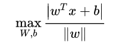
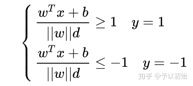
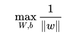
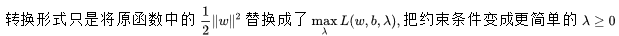

## SVM

**支持向量机 Support Vector Machine**

## 前言

> 在深度学习变得火热之前，SVM是最受欢迎的模型，因为SVM有充分的数学原理支撑，并且可得到全局最优解 (使用梯度下降的线性模型只能得到局部最优解) ，一般用于处理二分类任务。SVM是定义在特征空间上的间隔最大的线性分类器，学习策略就是使间隔最大化。

## 1 导读

本文是博主看过大量资料之后对SVM做的总结，拟从初学者的角度、以易理解的方式进行全面介绍，跟着文章手动推导一遍，打通你的任督二脉。

SVM涉及的知识比较多，大多数资料都是混起来讲不易理解。本文将其解耦开来分别进行介绍，文章结构如下：

1> 硬间隔SVM：基础版本的SVM，不涉及其他优化技术；

2> 软间隔SVM：赋予SVM容错能力的优化版本；

3> 核技巧：解决SVM在低维空间对样本不可分问题。

**硬间隔SVM是最基础的版本，软间隔与核技巧算是在基础版本上引入的优化方法。**

下面进入正题....

## 2 原理

本文原理推导围绕硬间隔SVM进行展开，加软间隔与核技巧的SVM原理与之雷同。

**2.1 基本概念**

两类样本点的分布如上图所示，位于中间位置的实线 H 是最优分割面，在其两侧是与之平行的两条虚线 H1、H2，两虚线之间的垂直距离就是最大化目标—间隔，位于两虚线上的样本点称为支持向量。

**2.2 问题定义**

**超平面的数学表达：**(二维空间中的超平面)

超平面在空间中的位置可由 W 和 b 决定。

**间隔的数学表达：**

d 表示**离超平面最近的样本 x (支持向量)** 到超平面的垂直距离，间隔则等于2倍的 d ，所以得到最大化目标为 2d，为了简化优化目标，省略常数项2，即最大化目标为 d。

于是我们有了整个问题的目标函数：

找到使得间隔 d 最大的 W 与 b ，即最优超平面。

**约束的数学表达：**

求解该目标函数之前，应该遵循一个约束，就是要保证所有样本点都分类正确 (硬间隔SVM)。即位于超平面上方的样本点标签为1，位于下方的样本点标签为-1。

该约束相当于是对 W 与 b 解空间的一个约束，相当于线性模型中加入的正则项，对权重大小进行约束，只不过是以不等式形式进行约束。

**于是得到整个问题的目标函数及约束：**

接下来的一大坨公式只是为了求解该目标函数进行的**化简**，化简过程中目标函数与约束条件都会随之变化，每次化简之后注意类比。得到化简的最终形式后使用SMO迭代求解即可得到最优超平面。

**2.3 第一次化简**（使用约束条件对目标函数进行化简）

硬间隔SVM要保证把所有样本点分类正确，所以有以下述约束。

将该约束用距离来描述：**所有样本点到超平面的距离都应大于间隔 d** 。则得到约束的下述形式：

(不加绝对值求得的距离是有正负的，大于 d 与小于 -d 表示位于超平面两边的两类样本点)

对基于距离的约束进行化简，两边同除 d 得到下式：

因为分母为常数，所以可将其融入权重 w 与 b 中，并且不会影响最终的求解结果。得到下式：

将两式合并得到约束的统一形式：

**(该约束对于所有的样本 x 都成立，不等式中的等号当且仅当x为支持向量时成立，很好理解)**

得到该形式的约束条件是为了化简目标函数：

我们知道，间隔 d 是支持向量到超平面的距离，所以目标函数中的 x 表示的是支持向量，而不是全部样本点。又由约束条件可知，当 x 为支持向量时等号成立，即：

又因为 y 等于正负1，所以：

目标函数化简为：

最优化通常为最小化目标，所以将目标函数进一步转换：

加平方是为了方便求导，到此第一次化简就算完成了，得到的目标函数及约束如下：

**2.4 第二次化简** （构造同解目标函数，方便转换成对偶问题）

带有不等式约束的优化问题难以求解，所以为了方便求解需要先转换成对偶问题，对偶问题的转换公式如下：

目标函数跟上述形式有些不同，所以需要先将目标函数构造成 max min 的形式方便进行对偶转换。形式改变的同时要保证**与原函数保持同解，并且约束条件也保持相同**。那么要如何构造上述形式的同解函数呢？

这里直接给出构造出的同解函数，然后给出与原函数同解同约束的证明。

原目标函数形式如下:

首先用拉格朗日乘子法，将不等式约束融入目标函数中，因为有N个约束，所以需要对所有约束进行累加。

然后即可将原目标函数与约束转换成以下形式：

接下来是证明转换形式后的目标函数与原函数同解同约束：

于是得到：

那么有以下等式：

所以形式转换后的函数可等价于原函数，并且约束条件也相同，证毕。

**2.5 对偶问题的引入**

2.4节对原函数的形式进行转换，只是为了便于引入对偶问题。2.4节得到的目标函数如下：

该形式的目标函数满足强对偶关系（此处不再证明），所以可以引入其对偶问题：

转换成对偶问题后，目标函数就容易求解了。求解步骤如下：

**1> 先求内层的最小化目标：**

要求解令上式最小化的w、b，分别对w、b求偏导，然后令偏导数为0，得到的结果带入上式即可得到极小值。

先对b求导：

将结果代入函数进行化简：

(第三项累加因为多乘了xi，所以不一定为0)

再对w求导：

代入目标函数进行化简：

上式化简得到的结果即为内层 min 的结果。

**2>再求外层最大化目标：**

(化简过程中产生的约束条件也应加入进来，作为KKT条件)

取负号转换成求最小值：

然后使用 [SMO](https://zhuanlan.zhihu.com/p/29212107) 求解即可， SMO每次更新两个参数 $\lambda$ ，其他的都当作常数项，依次重复进行，直到所有参数收敛。

通过SMO迭代求解得到所有的 $\lambda _{i}$ 之后，再通过下式得到 w 与 b，即得到了最优超平面。

到此，硬间隔SVM的原理推导就结束了，公式很多，但是不难，细细咀嚼推导一遍即可掌握。

## 3 软间隔与核技巧

**3.1 软间隔**

软间隔是允许SVM存在分错的样本，但是要控制其错误数量尽可能的少。所以软间隔SVM引入了一个描述分错样本数量的损失，加入了目标函数共同进行优化。

$\xi_{i}$ 表示Hinge loss，用于量化样本的被分类错误的程度，C为超参数，控制SVM允许出错的程度，C越大，容许的错误 $\xi_{i}$ 必须越小，模型越严格，反之亦然。

软间隔SVM的原理推导同硬间隔SVM，只是在目标函数中多了一个正则项。

**[注]：对于软间隔SVM，在间隔内的点同样可以影响超平面的位置，所以也属于支持向量。**

**3.2 核技巧**

之前介绍的硬间隔和软间隔都是指样本完全线性可分或者大部分样本点线性可分的情况，但是可能存在一种情况是样本点不再线性可分，比如二维空间中环形分布的数据点。

解决方法就是：**将二维线性不可分样本点映射到高维空间中，让样本点在高维空间线性可分。**

但是将样本从低维映射到高维之后，维度可能很大，也可能是无限维，此时计算两两样本的点乘，计算量太大。所以引入核函数 k(xi, xj) 来表示映射之后内积的结果，而不再将 x 显式的分别映射成高维向量，再去计算点积，引入核函数可以有效降低计算量。

**常见核函数：**

线性核函数：

多项式核函数：

高斯核函数：(存在需要调整的超参数)

## 4 总结

**硬间隔SVM推导步骤：**

> 1 根据硬间隔要求全部分类正确，得到约束的数学表达式，根据支持向量到超平面的距离，得到最大化目标函数；
> 2 第一次化简：使用基于距离的约束表达式，对目标函数进行化简，将其分子化为1；
> 3 第二次化简：为了方便引入对偶问题，先用拉格朗日乘子法将约束融入目标函数，然后构造与目标函数同解的特殊形式的函数；
> 4 得到特殊形式的函数之后，转换成对偶函数进行求解。先求内层 min, 再求外层 max, 化简得到最终只包含 λ 的目标函数；
> 5 使用SMO求解所有 λ ，然后再根据 λ 求 w 与 b 即得到最优超平面。

**SVM容易产生疑问的点：**

**1 为什么一次要更新两个参数？**

因为存在一个KKT约束为：

其中 y 取值为正负1，所以参数 λ 两两之间不是相互独立的，它们呈线性相关，一个参数的变化会引起另一个参数变化，所以需要一次更新两个参数。

**2 为什么说最优超平面仅由支持向量决定？**

**SVM优缺点：**

**优点：**

- 有严格的数学理论支撑，SVM是一个凸优化问题，所以求得的解一定是全局最优而不是局部最优;
- 引入核函数后可处理线性与非线性可分的二分类任务;
- 最优超平面只由少数的支持向量所确定，计算的复杂性取决于支持向量的数目。

**缺点：**

- 训练时间长，采用SMO算法求解目标函数时，每次都需要挑选一对参数，固定其他参数进行优化，因此时间复杂度为O(n^2)，其中n为训练样本的数量, 因此SVM只适合数据量较少的任务。
- SVM只适用于二分类，但是可通过组合多个SVM来处理多分类任务，同时推广的SVR也可处理回归任务。

**希望看完此文的你能够有所收获~**

## 更多资料

这个讲得好：[一文读懂支持向量机——SVM（细节解读） - 知乎 (zhihu.com)](https://zhuanlan.zhihu.com/p/259850768)

[支持向量机（转化为对偶问题）哔哩哔哩](https://www.bilibili.com/video/BV1qf4y1x7kB?p=13&vd_source=5ed8eb14651ad8efbf97fd6f8c41c1ca)

[零基础学SVM—Support Vector Machine(一) - 知乎 (zhihu.com)](https://zhuanlan.zhihu.com/p/24638007)

[支持向量机(SVM)算法原理 - 作业部落 Cmd Markdown 编辑阅读器 (zybuluo.com)](https://www.zybuluo.com/77qingliu/note/1137445#什么是支持向量机)