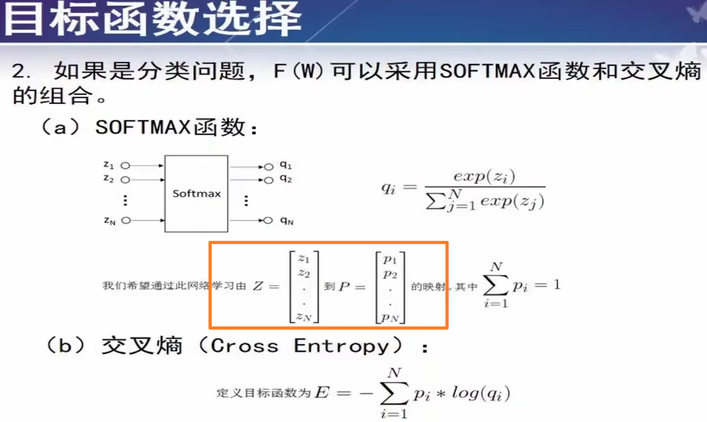

## 神经元的数学模型

看视频讲得更好：[3.1.1--人工神经网络（神经元的数学模型）哔哩哔哩bilibili](https://www.bilibili.com/video/BV1qf4y1x7kB?p=20&vd_source=5ed8eb14651ad8efbf97fd6f8c41c1ca)

自编码器：它的目的是将输入数据压缩成一个或多个维度较低的表示，并能够在解码过程中恢复原始数据。

个人认为自编码器就是一个逆运算来恢复之前的状况，低维如果可以恢复则说明低维数据较好的保留了数据特征

这里推荐看唐宇迪讲的CNN，动图很清晰