# 全连接层

## 前向传播、反向传播和计算图

> 在神经网络中，为什么说信号向前传播，误差反向传播？你能详细地讲讲吗？
>
> 在神经网络中，信号向前传播（Forward Propagation）是指数据从输入层流向输出层的过程，同时经过各个隐藏层，最终生成预测结果。而误差反向传播（Backpropagation）是指根据预测结果与真实标签之间的差异，将误差信号从输出层反向传播回网络，通过调整权重和偏置来更新模型参数，以提高模型的性能。
>
> - 信号的向前传播是指输入数据从网络的输入层经过一层层的神经元传递，并最终得到网络的输出。在该过程中，每个神经元会对收到的输入信号进行加权求和，并通过激活函数进行非线性转换，然后将结果传递给下一层的神经元。这个过程持续进行，直到信号传达到输出层，得到最终的预测结果。
>
> - 误差的反向传播是指通过比较网络的输出结果与目标输出之间的差别，计算出网络的误差，并将这个误差反向传播回网络中的每一层，以更新每个神经元的权重和偏置。通过反向传播误差，我们可以计算出每个神经元对整体误差的贡献，并相应地调整它们的权重和偏置，以使得网络的输出结果与目标输出更加接近。
>
> 信号向前传播的过程可以简单描述为以下几个步骤：
>
> 1. 输入层：将输入数据传递给神经网络的输入层节点。
>
> 2. 隐藏层：通过线性变换和非线性激活函数，将输入数据转换为更高级别的特征表示。这些特征表示们会在每一层之间传递，直至达到输出层。
>
> 3. 输出层：根据最后一个隐藏层的输出计算出预测结果，并将其与真实标签进行比较以计算损失（或误差）。
>
> 误差反向传播的过程可以详细描述为以下几个步骤：
>
> 1. 计算损失：通过损失函数（例如均方误差或交叉熵）计算预测结果与真实标签之间的差异。
>
> 2. 反向传播误差：从输出层开始，将损失信号通过链式法则（基于偏导数的乘积规则）进行反向传播。在每一层，根据上一层的输出和当前层的权重，计算当前层节点对损失的贡献。这样就得到了每个节点的误差信号。
>
> 3. 更新参数：根据误差信号和梯度下降等优化算法，更新神经网络中的参数（包括权重和偏置），以最小化损失函数。
>
> 通过重复进行信号向前传播和误差反向传播的过程，神经网络逐步调整其参数，不断优化模型，使预测结果更接近真实标签。这种端到端的训练方式，使神经网络能够学习到数据中的有用特征，并将其应用于新的数据预测。

我们已经学习了如何用小批量随机梯度下降训练模型。然而当实现该算法时，我们只考虑了通过*前向传播*（forward propagation）所涉及的计算。在计算梯度时，我们只调用了深度学习框架提供的反向传播函数，而不知其所以然。

梯度的自动计算（自动微分）大大简化了深度学习算法的实现。在自动微分之前，即使是对复杂模型的微小调整也需要手工重新计算复杂的导数，学术论文也不得不分配大量页面来推导更新规则。本节将通过一些基本的数学和计算图，深入探讨*反向传播*的细节。首先，我们将重点放在带权重衰减（$L_2$正则化）的单隐藏层多层感知机上。

## 前向传播

*前向传播*（forward propagation或forward pass）指的是：按顺序（从输入层到输出层）计算和存储神经网络中每层的结果。

我们将一步步研究单隐藏层神经网络的机制，为了简单起见，我们假设输入样本是 $\mathbf{x}\in \mathbb{R}^d$，并且我们的隐藏层不包括偏置项。这里的中间变量是：

$$
\mathbf{z}= \mathbf{W}^{(1)} \mathbf{x},
$$

其中$\mathbf{W}^{(1)} \in \mathbb{R}^{h \times d}$是隐藏层的权重参数。将中间变量$\mathbf{z}\in \mathbb{R}^h$通过激活函数$\phi$后，我们得到长度为$h$的隐藏激活向量：

$$
\mathbf{h}= \phi (\mathbf{z}).
$$
隐藏变量$\mathbf{h}$也是一个中间变量。假设输出层的参数只有权重$\mathbf{W}^{(2)} \in \mathbb{R}^{q \times h}$，我们可以得到输出层变量，它是一个长度为$q$的向量：

$$
\mathbf{o}= \mathbf{W}^{(2)} \mathbf{h}.
$$
假设损失函数为$l$，样本标签为$y$，我们可以计算单个数据样本的损失项，

$$
L = l(\mathbf{o}, y).
$$
根据$L_2$正则化的定义，给定超参数$\lambda$，正则化项为
$$
s = \frac{\lambda}{2} \left(\|\mathbf{W}^{(1)}\|_F^2 + \|\mathbf{W}^{(2)}\|_F^2\right),
$$
其中矩阵的Frobenius范数是将矩阵展平为向量后应用的$L_2$范数。最后，模型在给定数据样本上的正则化损失为：

$$
J = L + s.
$$
在下面的讨论中，我们将$J$称为*目标函数*（objective function）。

## 前向传播计算图

绘制*计算图*有助于我们可视化计算中操作符和变量的依赖关系。下面是与上述简单网络相对应的计算图，其中正方形表示变量，圆圈表示操作符。左下角表示输入，右上角表示输出。注意显示数据流的箭头方向主要是向右和向上的。

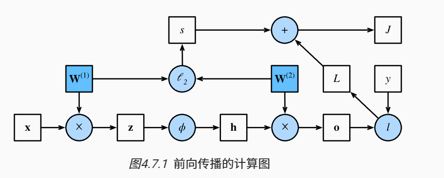

## 反向传播

*反向传播*（backward propagation或backpropagation）指的是计算神经网络参数梯度的方法。简言之，该方法根据微积分中的*链式规则*，按相反的顺序从输出层到输入层遍历网络。该算法存储了计算某些参数梯度时所需的任何中间变量（偏导数）。假设我们有函数$\mathsf{Y}=f(\mathsf{X})$和$\mathsf{Z}=g(\mathsf{Y})$，其中输入和输出$\mathsf{X}, \mathsf{Y}, \mathsf{Z}$是任意形状的张量。利用链式法则，我们可以计算$\mathsf{Z}$关于$\mathsf{X}$的导数
$$
\frac{\partial \mathsf{Z}}{\partial \mathsf{X}} = \text{prod}\left(\frac{\partial \mathsf{Z}}{\partial \mathsf{Y}}, \frac{\partial \mathsf{Y}}{\partial \mathsf{X}}\right).
$$
PS：在这里，我们使用$\text{prod}$运算符在执行必要的操作（如换位和交换输入位置）后将其参数相乘。对于向量，这很简单，它只是矩阵-矩阵乘法。对于高维张量，我们使用适当的对应项。运算符$\text{prod}$指代了所有的这些符号。

回想一下，在计算图中的单隐藏层简单网络的参数是$\mathbf{W}^{(1)}$和$\mathbf{W}^{(2)}$。**反向传播的目的是计算梯度$\partial J/\partial \mathbf{W}^{(1)}$和**
**$\partial J/\partial \mathbf{W}^{(2)}$。**为此，我们应用链式法则，依次计算每个中间变量和参数的梯度。计算的顺序与前向传播中执行的顺序相反，因为我们需要从计算图的结果开始，并朝着参数的方向努力。第一步是计算目标函数$J=L+s$相对于损失项$L$和正则项$s$的梯度。
$$
\frac{\partial J}{\partial L} = 1 \; \text{and} \; \frac{\partial J}{\partial s} = 1.
$$
接下来，我们根据链式法则计算目标函数关于输出层变量$\mathbf{o}$的梯度：

$$
\frac{\partial J}{\partial \mathbf{o}}
= \text{prod}\left(\frac{\partial J}{\partial L}, \frac{\partial L}{\partial \mathbf{o}}\right)
= \frac{\partial L}{\partial \mathbf{o}}
\in \mathbb{R}^q.
$$

接下来，我们计算正则化项相对于两个参数的梯度：

$$
\frac{\partial s}{\partial \mathbf{W}^{(1)}} = \lambda \mathbf{W}^{(1)}
\; \text{and} \;
\frac{\partial s}{\partial \mathbf{W}^{(2)}} = \lambda \mathbf{W}^{(2)}.
$$
现在我们可以计算最接近输出层的模型参数的梯度$\partial J/\partial \mathbf{W}^{(2)} \in \mathbb{R}^{q \times h}$。使用链式法则得出：

$$
\frac{\partial J}{\partial \mathbf{W}^{(2)}}= \text{prod}\left(\frac{\partial J}{\partial \mathbf{o}}, \frac{\partial \mathbf{o}}{\partial \mathbf{W}^{(2)}}\right) + \text{prod}\left(\frac{\partial J}{\partial s}, \frac{\partial s}{\partial \mathbf{W}^{(2)}}\right)= \frac{\partial J}{\partial \mathbf{o}} \mathbf{h}^\top + \lambda \mathbf{W}^{(2)}.
$$
为了获得关于$\mathbf{W}^{(1)}$的梯度，我们需要继续沿着输出层到隐藏层反向传播。关于隐藏层输出的梯度$\partial J/\partial \mathbf{h} \in \mathbb{R}^h$由下式给出：

$$
\frac{\partial J}{\partial \mathbf{h}}
= \text{prod}\left(\frac{\partial J}{\partial \mathbf{o}}, \frac{\partial \mathbf{o}}{\partial \mathbf{h}}\right)
= {\mathbf{W}^{(2)}}^\top \frac{\partial J}{\partial \mathbf{o}}.
$$

由于激活函数$\phi$是按元素计算的，计算中间变量$\mathbf{z}$的梯度$\partial J/\partial \mathbf{z} \in \mathbb{R}^h$需要使用按元素乘法运算符，我们用$\odot$表示：

$$
\frac{\partial J}{\partial \mathbf{z}}
= \text{prod}\left(\frac{\partial J}{\partial \mathbf{h}}, \frac{\partial \mathbf{h}}{\partial \mathbf{z}}\right)
= \frac{\partial J}{\partial \mathbf{h}} \odot \phi'\left(\mathbf{z}\right).
$$

最后，我们可以得到最接近输入层的模型参数的梯度$\partial J/\partial \mathbf{W}^{(1)} \in \mathbb{R}^{h \times d}$。根据链式法则，我们得到：

$$
\frac{\partial J}{\partial \mathbf{W}^{(1)}}
= \text{prod}\left(\frac{\partial J}{\partial \mathbf{z}}, \frac{\partial \mathbf{z}}{\partial \mathbf{W}^{(1)}}\right) + \text{prod}\left(\frac{\partial J}{\partial s}, \frac{\partial s}{\partial \mathbf{W}^{(1)}}\right)
= \frac{\partial J}{\partial \mathbf{z}} \mathbf{x}^\top + \lambda \mathbf{W}^{(1)}.
$$

## 训练神经网络

在训练神经网络时，前向传播和反向传播相互依赖。对于前向传播，我们沿着依赖的方向遍历计算图并计算其路径上的所有变量。然后将这些用于反向传播，其中计算顺序与计算图的相反。

以上述简单网络为例：一方面，在前向传播期间计算正则项取决于模型参数$\mathbf{W}^{(1)}$和$\mathbf{W}^{(2)}$的当前值。它们是由优化算法根据最近迭代的反向传播给出的。另一方面，反向传播期间参数的梯度计算，取决于由前向传播给出的隐藏变量$\mathbf{h}$的当前值。

因此，在训练神经网络时，在初始化模型参数后，我们交替使用前向传播和反向传播，**利用反向传播给出的梯度来更新模型参数**。注意，反向传播重复利用前向传播中存储的中间值，以避免重复计算。带来的影响之一是我们需要保留中间值，直到反向传播完成。这也是训练比单纯的预测需要更多的内存（显存）的原因之一。此外，这些中间值的大小与网络层的数量和批量的大小大致成正比。因此，使用更大的批量来训练更深层次的网络更容易导致*内存不足*（out of memory）错误。

## 小结

* 前向传播在神经网络定义的计算图中按顺序计算和存储中间变量，它的顺序是从输入层到输出层。
* 反向传播按相反的顺序（从输出层到输入层）计算和存储神经网络的中间变量和参数的梯度。
* 在训练深度学习模型时，前向传播和反向传播是相互依赖的。
* 训练比预测需要更多的内存。

## 练习和参考资料

习题答案是评论区的，供参考：

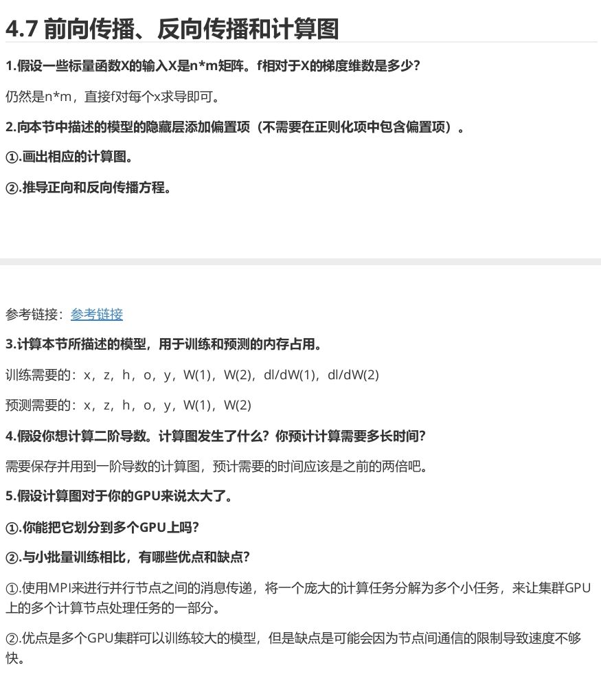

原文：[4.7. 前向传播、反向传播和计算图 — 动手学深度学习 2.0.0 documentation (d2l.ai)](https://zh.d2l.ai/chapter_multilayer-perceptrons/backprop.html#equation-eq-forward-s)

还可以看这个视频，这个视频很仔细地讲了反向传播：[1.2 卷积神经网络基础补充](https://www.bilibili.com/video/BV1M7411M7D2/?share_source=copy_web&vd_source=340f3fe423cd0f0f68fb72953f912437)

## 反向传播图解(可以直接看这个)

### 误差的计算

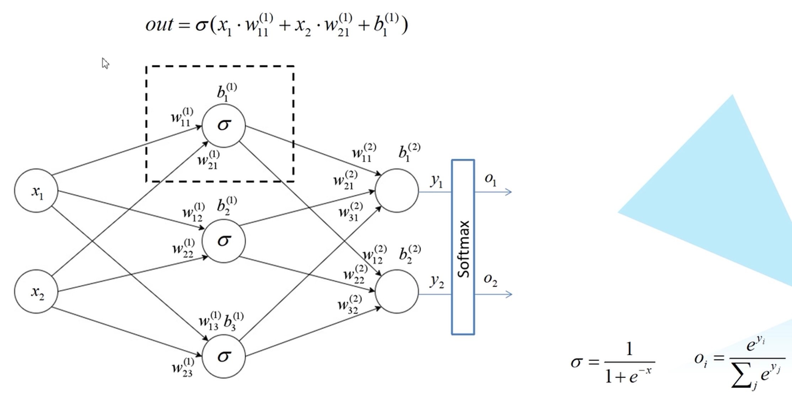

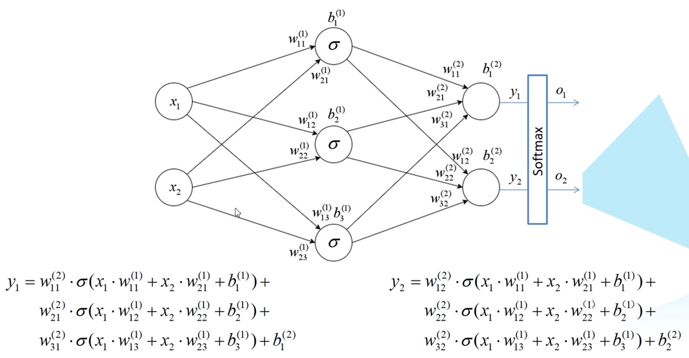

对输出进行softmax处理：

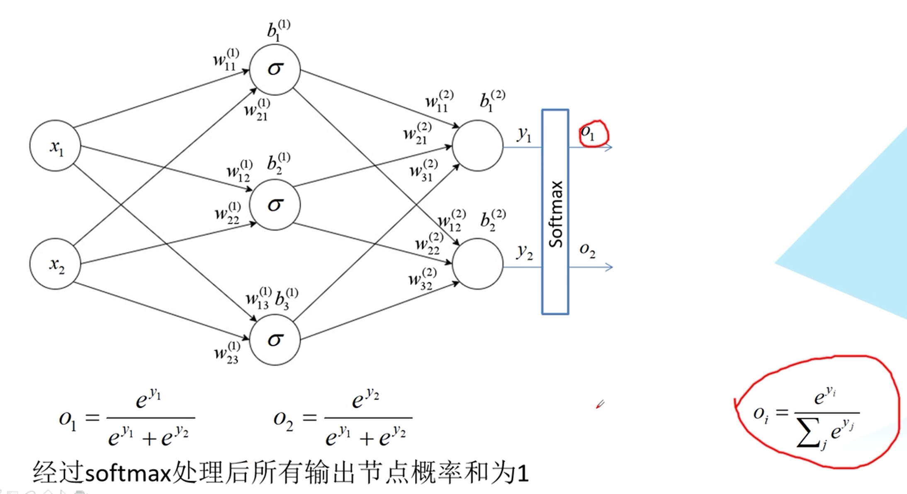

损失的计算：交叉熵损失函数

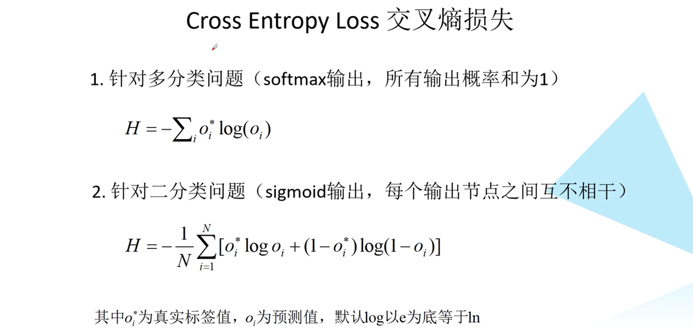

损失函数的表达式：

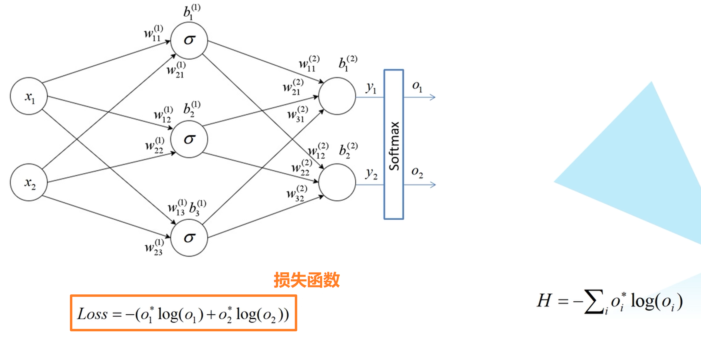

### 误差的反向传播

得到损失函数后，对它进行误差的反向传播

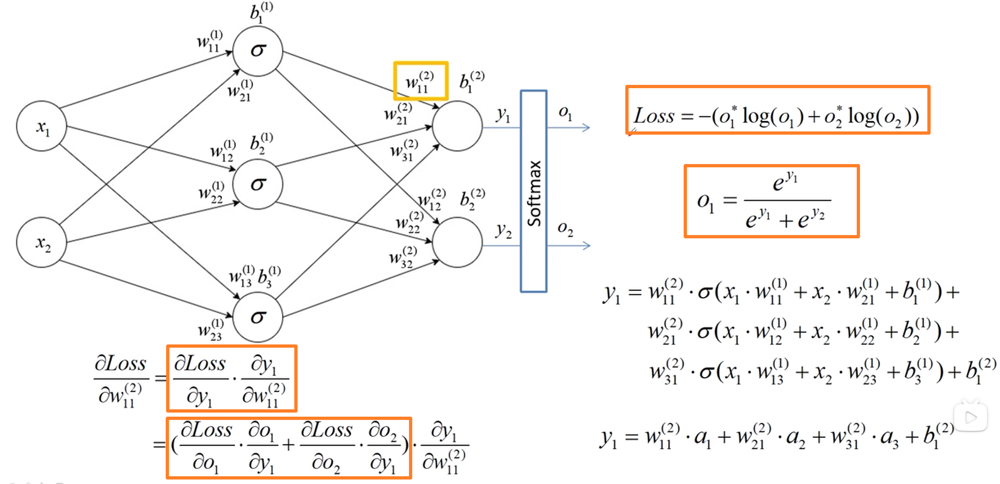

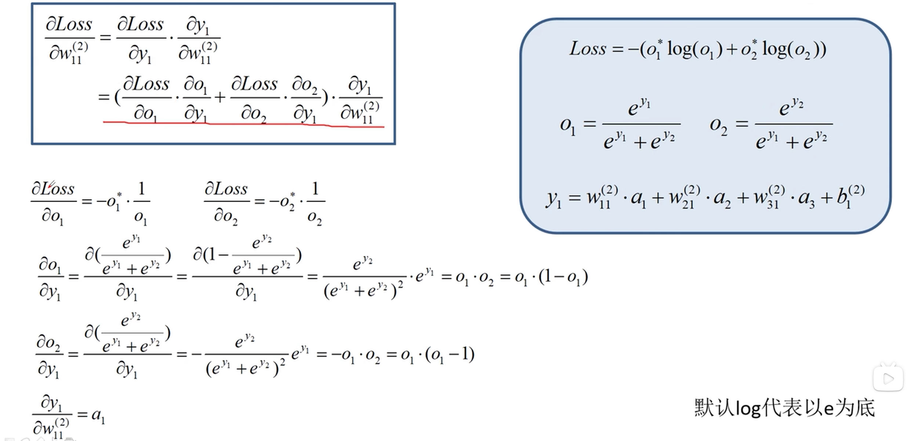

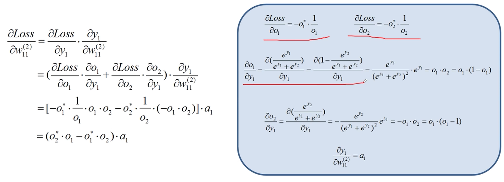

### 权重的更新

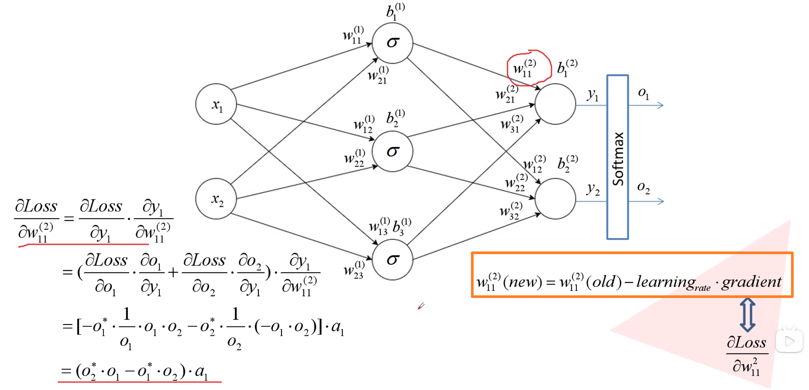

损失函数的梯度（就是$\frac{\partial Loss }{\partial w_{11}^{(2)}}$）的作用是更新参数（这里是$w_{11}^{(2)}$）的值，更新的方法是按上面的公式，更新的目的是尽可能地最小化损失函数。

但是需要说明的是，当我们采用梯度下降法更新参数时，最后求得的是局部最优解，并不一定是全局最优的，但是这样就足够了。

还有就是更新参数的时候，我们通常每轮更新都是找的一个批次（batch）的数据来训练（即**每轮更新都只用一个batch的数据来前向训练和反向传播计算损失**，这种方法叫做小批量随机梯度下降，关于小批量随机梯度下降请看`线性回归.md`），此时损失函数的梯度指向的不是全局最优方向，而是当前批次的最优方向，用形象的话来说，实际上你并不是找到一条最陡的路下山，而是像一个醉汉下山一样更新损失函数。

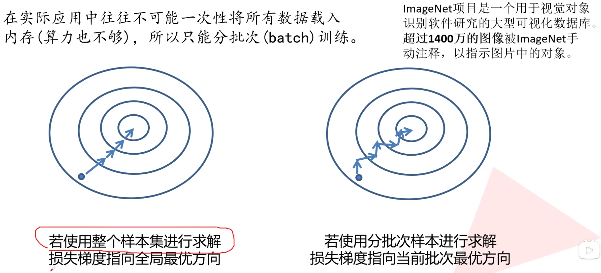

权重更新的函数叫做优化器：

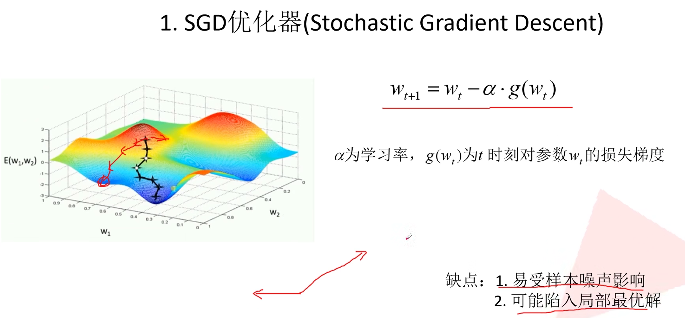

引入动量

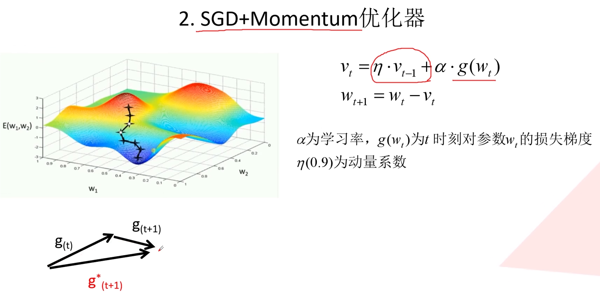

引入二阶动量

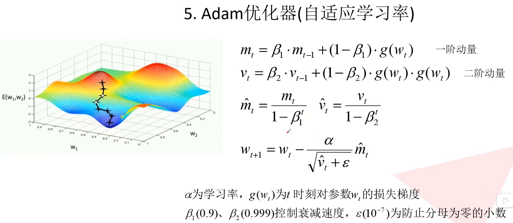

# 卷积层

## 卷积的基本概念

**卷积核（Kernel）：**卷积核（Convolutional Kernel），也称为滤波器（Filter）或权重矩阵（Weight Matrix）。它是卷积操作的**感受野**，直观理解就是一个滤波矩阵，普遍使用的卷积核大小为 3×3、5×5 等。就是图上的滑动窗口。

**步长（Stride）：**卷积核遍历特征图时每步移动的像素，如步长为 1 则每次移动 1 个像素，步长为 2 则每次移动 2 个像素（即跳过 1 个像素），以此类推；

**填充（Padding）：**处理特征图边界的方式，一般有两种，一种是对边界外完全不填充，只对输入像素执行卷积操作，这样会使输出特征图的尺寸小于输入特征图尺寸；另一种是对边界外进行填充（一般填充为 0），再执行卷积操作，这样可使输出特征图的尺寸与输入特征图的尺寸一致；

**通道（Channel）：**卷积层的通道数（层数）。在卷积神经网络（CNN）中，通道（Channel）指的是输入或输出的特征图的维度。通道可以理解为特征图的**深度**（我们常常叫channel为**矩阵的深度**）或数量。
在卷积层中，输入数据通过多个卷积核进行卷积操作，**每个卷积核都产生一个输出特征图。这些输出特征图可以看作是不同的通道**。**每个通道对应于一个卷积核学习到的特定特征**。通常情况下，第一层的通道数由输入图像的通道数决定，后续层的通道数可以根据网络设计和任务需求进行设置。
例如，在RGB图像上进行卷积运算时，输入数据有三个通道（红、绿、蓝），经过卷积运算后，每个卷积核会生成一个输出特征图，而这些特征图在卷积层中就被看作是不同的通道。
通道的存在使得网络能够学习不同抽象层次的特征表示。低层通道主要捕捉边缘、纹理等低级特征，而高层通道则更加抽象，可以表示更复杂的对象和概念。
通过增加通道数，网络可以学习到更多种类的特征，并提高模型的表达能力。同时，通道之间的关系也可以被网络自动学习，从而更好地提取出图像中的有用信息。

如下图是一个**卷积核（kernel）**为 3×3、**步长（stride）**为 1、**填充（padding）**为 1 的二维卷积：

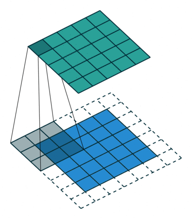

## 卷积计算

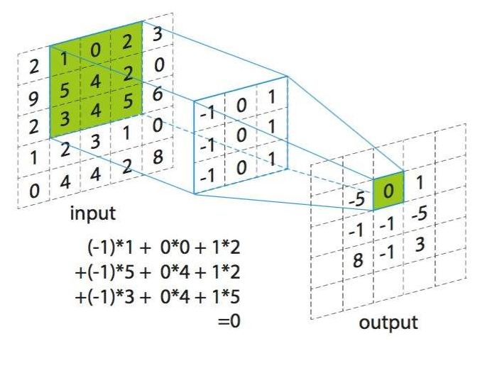

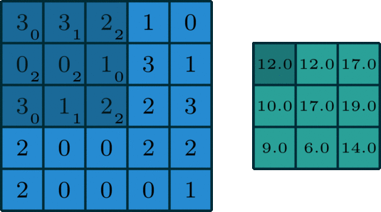

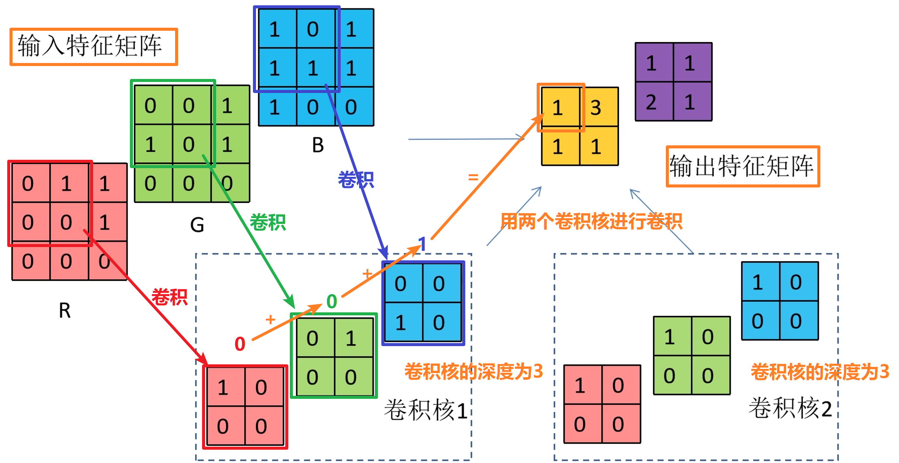

**注意（非常重要）：**

- **卷积核的channel与输入特征层的channel相同**

- **输出的特征矩阵channel与卷积核个数相同**

下图中只有一个卷积核（因为输出矩阵的深度为一），这个卷积核有三个通道（因为输入矩阵的深度为三）：

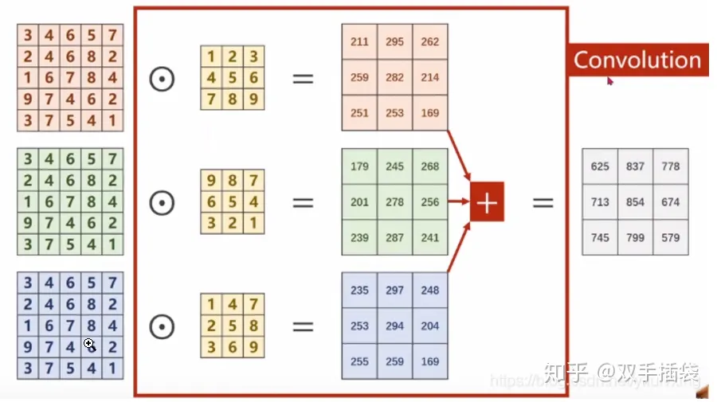

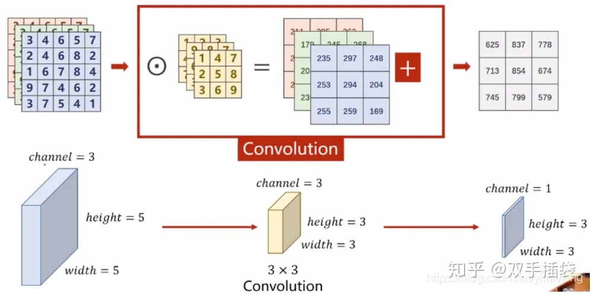

下图有m个卷积核（输出的矩阵的深度为m），每个卷积核有n个通道（因为输入矩阵的深度为n）：

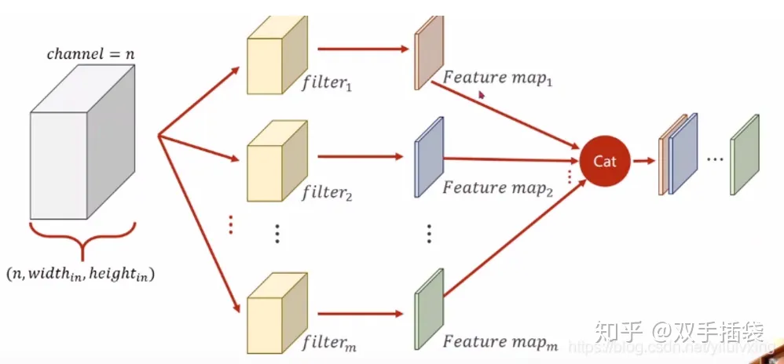

思考：

- 加上偏移量之后如何计算？

  对矩阵中的每个元素加偏移量。

- 激活函数的作用是？

  引入非线性运算。

  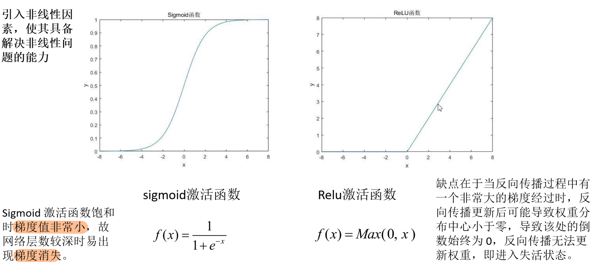

- 卷积过程中出现越界怎么办？

  补零操作（padding）。

### 1*1卷积核

[1*1的卷积核的原理及作用 - 梦想是能睡八小时的猪 - 博客园 (cnblogs.com)](https://www.cnblogs.com/End1ess/p/15433206.html#:~:text=输入和输出具有相同的高和宽。输出中的每个元素来自输入中在高和宽上相同位置的元素在不同通道之间的按权重累加。假设我们将通道维当作特征维，将高和宽维度上的元素当成数据样本%2C,那么1*1的卷积层和全连接层等价%2C即不改变高和宽的情况下%2C将不同通道数据实现互通%2C降低数据的通道数.)

特点：

- 1x1的卷积核可以用于改变输入矩阵的通道数，但是不会改变输入矩阵的宽和高。
- 1x1的卷积核能减少参数个数

下图只有一个1x1的卷积核，这个卷积核的channel=3，与输入矩阵的channel相同，所以输出矩阵的channel=1，因为只有一个卷积核，观察输入矩阵(3×W×H)和输出矩阵(1×W×H)，可以发现宽和高没有改变，只有channel数改变了，而且channel=卷积核个数。

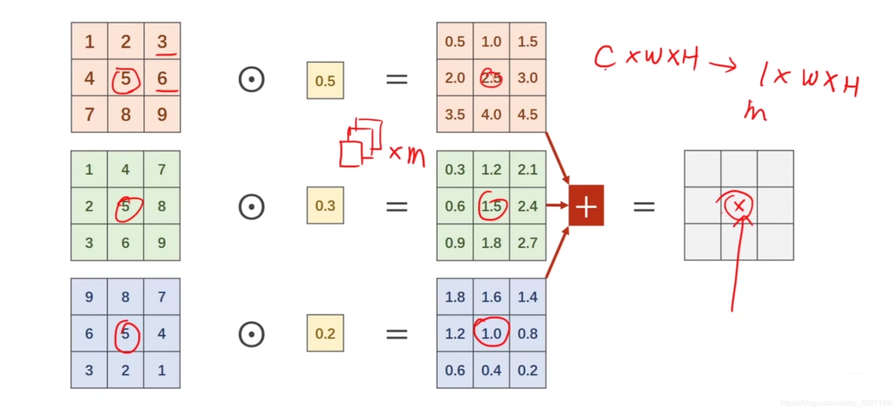

减少参数个数：来自视频[5.1 GoogLeNet网络详解 精准空降到 05:26](https://www.bilibili.com/video/BV1z7411T7ie/?share_source=copy_web&vd_source=340f3fe423cd0f0f68fb72953f912437&t=326)，1×1的卷积核可以减少输入矩阵的深度，从而减少卷积参数，也就减少了计算量。

> 补充：**卷积层的可学习参数个数** = W × H × 输入通道数 × 输出通道数

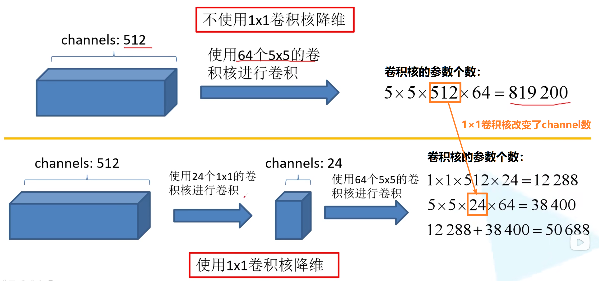

## 卷积的特性

- 拥有局部感知机制
- 权值共享

目的：进行图像特征的提取。

## 卷积后的矩阵大小

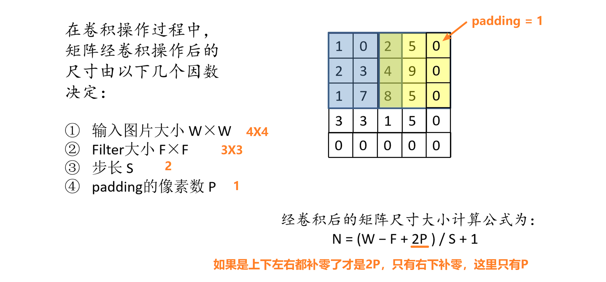

公式：
$$
\frac{W - F + 2P}{S} + 1
$$

# 池化层

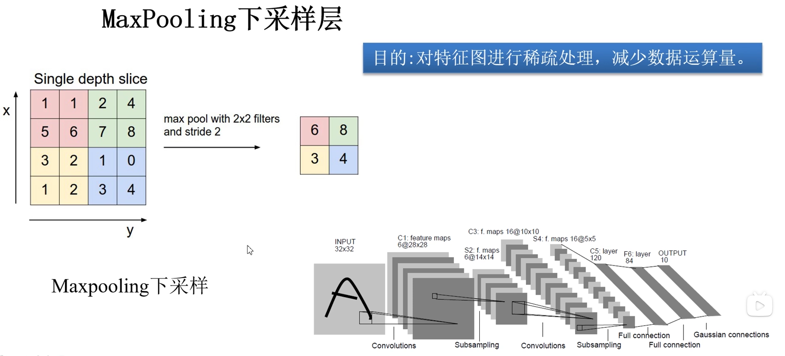

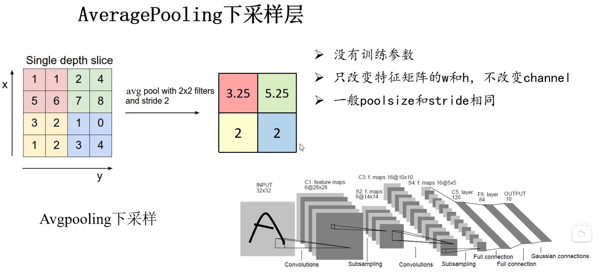

分类：最大池化，平均池化

目的：对特征图进行稀疏处理，减少数据运算量。

特点：

- 池化层没有训练参数
- 只改变特征矩阵的宽和高，不改变深度（channel）
- 一般步距和池化核的大小一样

# 视频

[1.1 卷积神经网络基础\_哔哩哔哩_bilibili](https://www.bilibili.com/video/BV1b7411T7DA/?spm_id_from=333.788&vd_source=5ed8eb14651ad8efbf97fd6f8c41c1ca)

