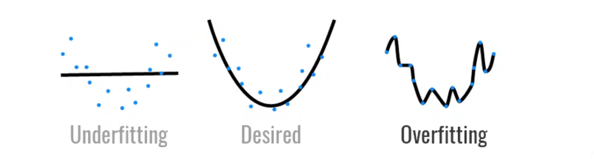
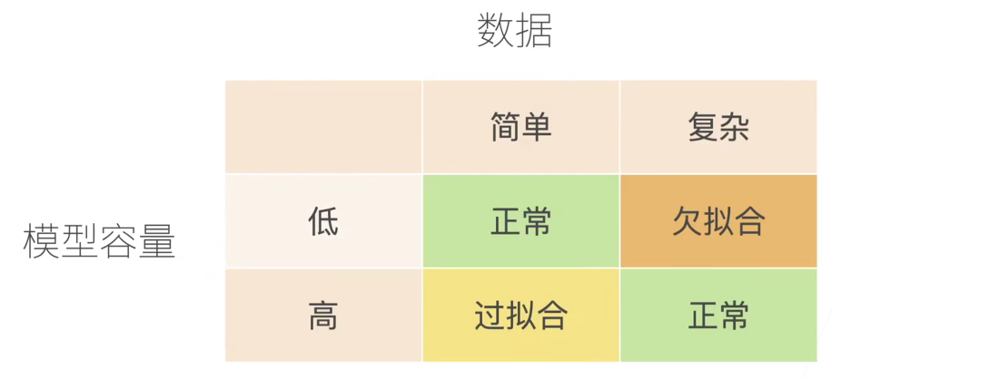
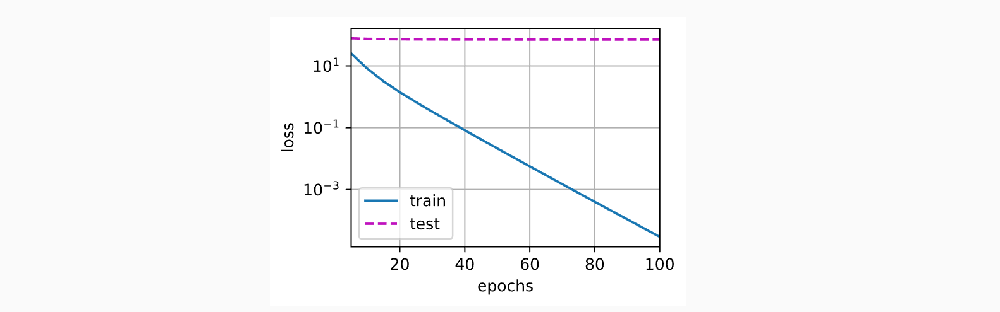
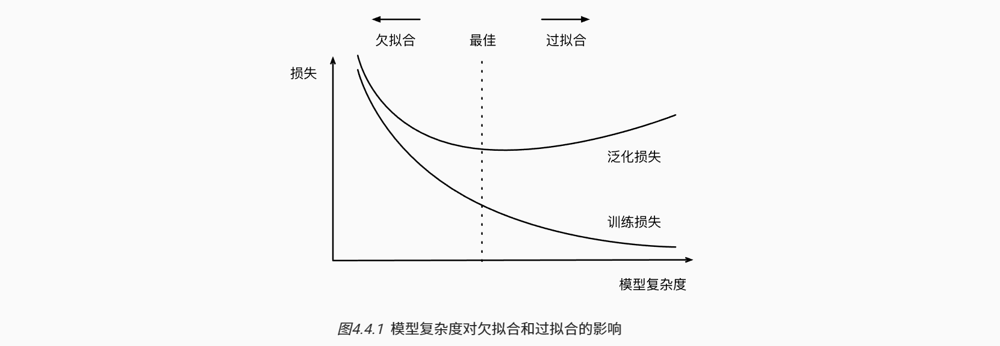
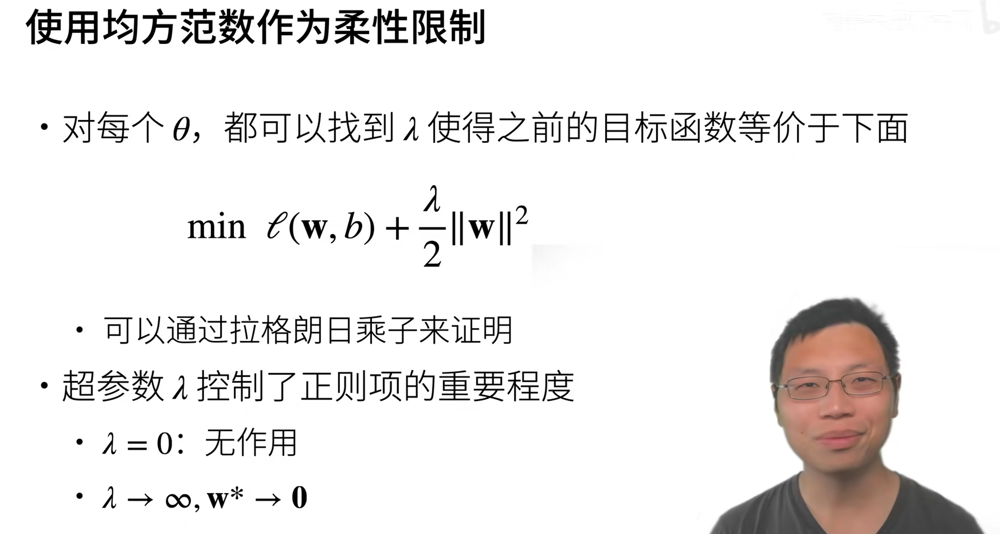
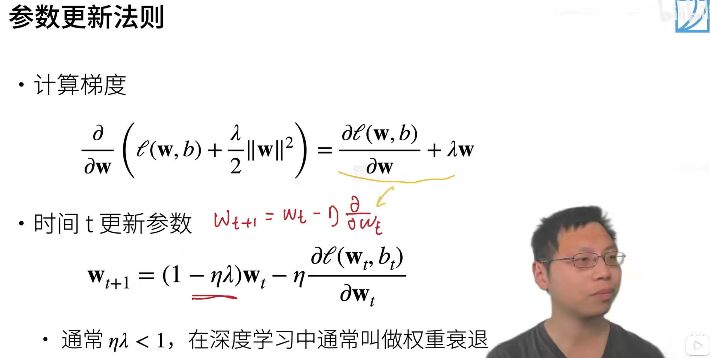
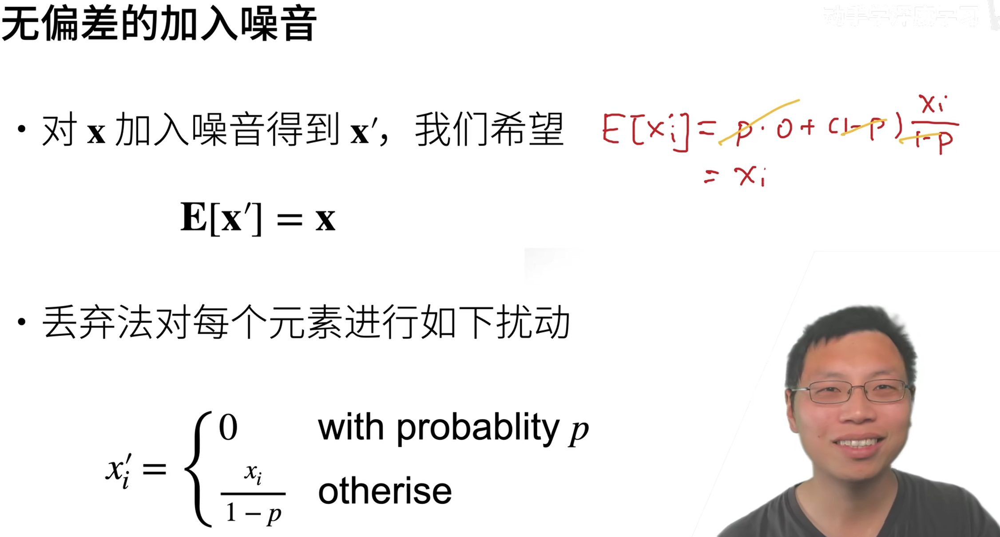
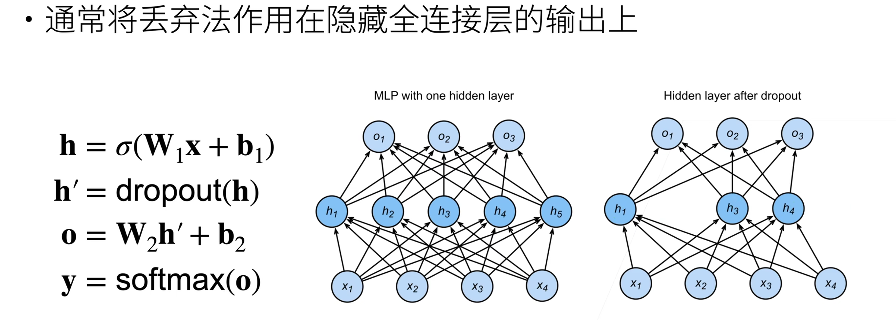

## 欠拟合和过拟合

[过拟合和欠拟合\_哔哩哔哩_bilibili](https://www.bilibili.com/video/BV1kX4y1g7jp?p=2&vd_source=5ed8eb14651ad8efbf97fd6f8c41c1ca)

[4.4. 模型选择、欠拟合和过拟合 — 动手学深度学习 2.0.0 documentation (d2l.ai)](https://zh.d2l.ai/chapter_multilayer-perceptrons/underfit-overfit.html)

过拟合：模型越复杂，数据越少越简单，过拟合越明显。相当于这个复杂的模型记住了所有的训练数据，但是面对新的数据（测试集）时，模型的泛化能力就不够。

欠拟合：模型越简单，数据越复杂，欠拟合越明显。

过拟合的表现是：在训练集上表现优秀，但是在测试集上表现不好，误差很大。因为过拟合就是泛化能力差，如下图就是严重的过拟合：

## 权重衰退

[4.5. 权重衰减 — 动手学深度学习 2.0.0 documentation (d2l.ai)](https://zh.d2l.ai/chapter_multilayer-perceptrons/weight-decay.html)

[权重衰退\_哔哩哔哩_bilibili](https://www.bilibili.com/video/BV1UK4y1o7dy?p=1&vd_source=5ed8eb14651ad8efbf97fd6f8c41c1ca)

权重衰退就是指每次更新参数的时候，后面的梯度项没有变，但是前面的参数乘上了一个小于一的数，因此叫权重衰退。

### 什么是正则化

可以看这个视频：[“L1和L2正则化”直观理解(之一)，从拉格朗日乘数法角度进行理解\_哔哩哔哩_bilibili](https://www.bilibili.com/video/BV1Z44y147xA/?spm_id_from=333.999.0.0&vd_source=5ed8eb14651ad8efbf97fd6f8c41c1ca)

**正则项是在机器学习中用于控制模型复杂度的一种技术**。在训练模型时，我们希望找到一个既能很好地拟合训练数据又能具有良好泛化能力的模型。而过于复杂的模型容易出现过拟合的问题，即在训练数据上表现出色，但在未见过的数据上表现较差。为了避免这种情况，可以引入正则化技术。

**正则项是一种附加在损失函数上的惩罚项**，用于约束参数的取值范围或使部分参数趋于零。通过增加正则项，可以限制模型参数的大小，从而实现对模型复杂度的控制。常见的正则项有L1正则项和L2正则项。

- L1正则项（L1 regularization）也称为Lasso正则化，它通过对模型参数的绝对值进行惩罚，鼓励模型中的某些特征权重趋于零，从而实现特征选择的效果。
- L2正则项（L2 regularization）也称为Ridge正则化，它通过对模型参数的平方进行惩罚，使得各个参数都尽可能接近于零，降低模型的复杂度。

正则化技术能够有效避免模型过拟合，提高模型的泛化能力。通过调整正则项的系数，可以在偏置和方差之间取得平衡，选择适当的模型复杂度。 

## dropout

[13 丢弃法【动手学深度学习v2】\_哔哩哔哩_bilibili](https://www.bilibili.com/video/BV1Y5411c7aY/?spm_id_from=333.788.recommend_more_video.1&vd_source=5ed8eb14651ad8efbf97fd6f8c41c1ca)

[4.6. 暂退法（Dropout） — 动手学深度学习 2.0.0 documentation (d2l.ai)](https://zh.d2l.ai/chapter_multilayer-perceptrons/dropout.html)

随机丢弃(Dropout)。为了避免系统参数更新过快导致过拟合，每次利用训练样本更新参数时候，随机的“丢弃”一定比例的神经元，被丢弃的神经元将不参加训练过程，输入和输出该神经元的权重系数也不做更新。这样每次训练时，训练的网络架构都不一样，而这些不同的网络架构却分享共同的权重系数。实验表明，随机丢弃技术减缓了网络收敛速度，也以大概率避免了过拟合的发生。

最早的解释是：每次随机采样一些子神经网络来做训练，拿到这些小的神经网络最后做平均。后来人们根据实验，它的实验结果跟正则项的效果一样，所以现在我们认为**它就是一个正则项**。（正则化技术能够有效避免模型过拟合，提高模型的泛化能力。）**暂退法可以避免过拟合**，它通常与控制权重向量的维数和大小结合使用的。

注意，只有训练的时候使用dropout，预测的时候是不需要的。

**总结**

- 丢弃法将一些输出项随机置0来控制模型复杂度
- 常作用在多层感知机的隐藏层输出上
- 丢弃概率是控制模型复杂度的超参数

