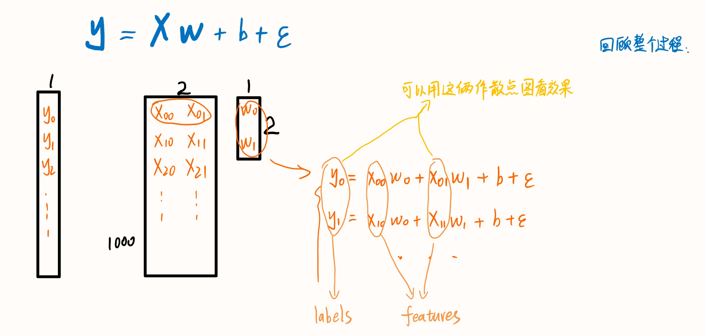
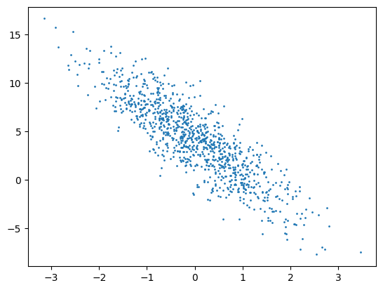
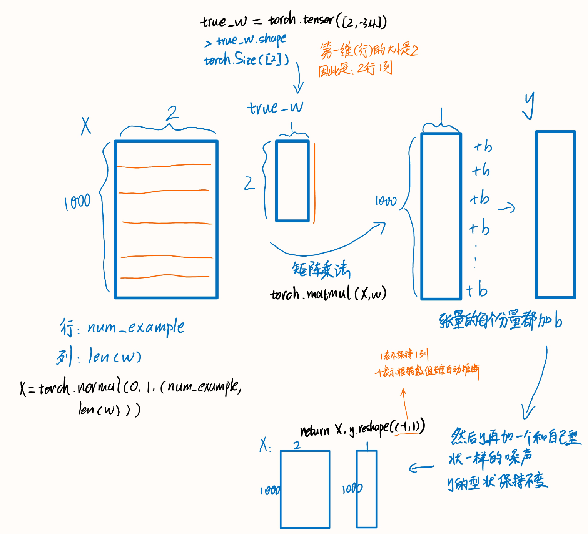

## 线性回归只使用numpy

代码实现（只使用`numpy`）：

```python
import numpy as np

def mean_squared_error(y_true, y_pred):
    # 计算均方误差（Mean Squared Error，MSE）
    return np.mean((y_true - y_pred) ** 2)

def mini_batch_gradient_descent(X, y, learning_rate=0.01, batch_size=32, epochs=100):
    n_samples, n_features = X.shape
    n_batches = n_samples // batch_size

    # 初始化随机权重和偏置项
    np.random.seed(42)
    weights = np.random.randn(n_features)  # 初始化权重为随机值
    bias = np.random.randn()  # 初始化偏置项为随机值

    for epoch in range(epochs):
        # 每个epoch开始时对数据进行洗牌（随机打乱顺序）
        indices = np.random.permutation(n_samples)
        X_shuffled = X[indices]
        y_shuffled = y[indices]

        for batch in range(n_batches):
            # 获取当前小批量数据
            start = batch * batch_size
            end = (batch + 1) * batch_size
            X_batch = X_shuffled[start:end]
            y_batch = y_shuffled[start:end]

            # 前向传播计算预测值
            y_pred = np.dot(X_batch, weights) + bias

            # 计算梯度
            grad_weights = -(2 / batch_size) * np.dot(X_batch.T, (y_batch - y_pred))  # 权重梯度
            grad_bias = -(2 / batch_size) * np.sum(y_batch - y_pred)  # 偏置项梯度

            # 更新权重和偏置项
            weights -= learning_rate * grad_weights
            bias -= learning_rate * grad_bias

        # 每个epoch结束后打印损失值
        y_pred_all = np.dot(X, weights) + bias
        loss = mean_squared_error(y, y_pred_all)
        print(f"Epoch {epoch + 1}/{epochs}, Loss: {loss}")

    return weights, bias

# 示例数据用于演示
X = 2 * np.random.rand(100, 1)
y = 4 + 3 * X + np.random.randn(100, 1)

# 添加偏置项到X
X_b = np.c_[np.ones((100, 1)), X]

# 使用小批量梯度下降算法训练模型
weights, bias = mini_batch_gradient_descent(X_b, y, learning_rate=0.01, batch_size=10, epochs=50)

# 打印训练后的权重和偏置项
print("Trained weights:", weights)
print("Trained bias:", bias)
```

还有这个：

线性回归是一种用于预测数值型目标变量的简单机器学习算法。它建立了自变量（特征）与因变量（目标）之间的线性关系。我们将通过梯度下降算法来训练模型并找到最佳的线性拟合。

首先，让我们导入所需的库：

```python
import numpy as np
import matplotlib.pyplot as plt
```

接下来，我们定义线性回归模型类：

```python
class LinearRegression:
    def __init__(self, learning_rate=0.01, num_iterations=1000):
        self.learning_rate = learning_rate
        self.num_iterations = num_iterations
        self.weights = None
        self.bias = None
    
    def fit(self, X, y):
        num_samples, num_features = X.shape
        self.weights = np.zeros(num_features)
        self.bias = 0
        
        for _ in range(self.num_iterations):
            # 假设函数 h(x) = wx + b
            y_predicted = np.dot(X, self.weights) + self.bias
            
            # 计算损失函数
            loss = np.mean((y_predicted - y) ** 2)
            
            # 计算梯度
            d_weights = (1 / num_samples) * np.dot(X.T, (y_predicted - y))
            d_bias = (1 / num_samples) * np.sum(y_predicted - y)
            
            # 更新参数
            self.weights -= self.learning_rate * d_weights
            self.bias -= self.learning_rate * d_bias
        
    def predict(self, X):
        return np.dot(X, self.weights) + self.bias
```

现在，我们来测试一下这个线性回归模型。我们生成一些随机数据用于训练和测试：

```python
# 生成随机数据
np.random.seed(42)
X_train = 2 * np.random.rand(100, 1)
y_train = 4 + 3 * X_train + np.random.randn(100, 1)

X_test = np.array([[0], [2]])

# 创建线性回归模型对象并进行训练
model = LinearRegression(learning_rate=0.1, num_iterations=1000)
model.fit(X_train, y_train)

# 进行预测
y_pred = model.predict(X_test)

# 可视化结果
plt.scatter(X_train, y_train)
plt.plot(X_test, y_pred, color='red')
plt.xlabel('X')
plt.ylabel('y')
plt.title('Linear Regression')
plt.show()
```

在这段代码中，我们使用线性回归模型拟合训练数据，并通过预测方法获得测试数据的预测结果。最后，我们将训练数据和拟合线可视化，红色线条表示模型的预测。

请注意，这个实现只是一个简单的示例，还有很多可以优化和改进的地方，比如添加正则化项、使用更复杂的优化算法等。但这个实现应该足够帮助你理解线性回归的基本原理和从零开始的实现过程。


## 李沐线性回归的从零开始实现

### 先看这个

在机器学习中，权重 `w` 和偏差 `b` 通常被称为模型的参数（parameters）。

- 权重 `w` 是模型的参数之一，它表示特征与目标变量之间的关系强度。在线性回归中，`w` 是一个向量，每个元素对应着一个特征的权重。这些权重用于线性组合特征，以预测目标变量。
- 偏差 `b` 也是模型的参数之一，它表示在没有任何特征输入时目标变量的基准值。在线性回归中，它相当于截距（intercept）或偏移（offset）。

这些参数在训练过程中被调整，以使模型能够更好地拟合训练数据，并在未见过的数据上进行准确预测。在训练线性回归模型时，我们使用梯度下降等优化算法，通过最小化损失函数（如均方误差）来更新这些参数，以找到最佳的权重和偏差组合。一旦训练完成，模型的参数将代表学习到的线性关系，用于预测新的数据样本。

`y`叫做标签，`x`叫做特征。

人为事先设定的参数叫做算法的超参数（HYPER PARAMETER）。


### 线性回归原理

假设$y$是房价，房价跟$x_{0}$面积和$x_{1}$房间个数有关，如果我们假设他们的关系是线性的（实际上应该不是），我们可以用这个式子来表示他们的关系：$y = w_{0}x_{0} + w_{1}x_{1} + b$。在实际情况下我们有一些$y$和对应的$x$，而我们的目的就是找到合适的$w$和$b$，以便我们在遇到新的$x$时，我们也能用这个式子得到较为正确的预测值$y$。由于有很多组数据，例如下面的例子中就有1000组$y_{i}$，$x_{i,0}$，$x_{i,1}$ $(i=[0,999])$，我们把它们写成矩阵：




回顾整个过程：

首先我们有真实的权重向量$\mathbf{w} = [2, -3.4]^\top$、偏差$b = 4.2$，然后我们随机生成了特征向量$X$，用这些真实的参数得到标签$y$，然后加上随机噪声$\epsilon$，$\epsilon$可以视为模型预测和标签时的潜在观测误差，这样就得到了最终的$y$。在实际情况中特征$X$和标签$y$应该是准备好了的，但是这里是我们自己造的。

我们的目的是在训练过程中调整模型的参数，以使模型能够更好地拟合训练数据，并在未见过的数据上进行准确预测。在训练线性回归模型时，我们使用梯度下降等优化算法，通过最小化损失函数（如均方误差）来**更新这些参数，以找到最佳的权重和偏差组合**。如何衡量“最佳”，就是靠损失函数，本例中我们用的是均方损失函数。当权重和偏差最佳时，损失函数的值最小，所以我们用梯度下降法来找到损失函数的最小值。


### 生成数据集

为了简单起见，我们将**根据带有噪声的线性模型构造一个人造数据集。**我们的任务是使用这个有限样本的数据集来恢复这个模型的参数。我们将使用低维数据，这样可以很容易地将其可视化。在下面的代码中，我们生成一个包含1000个样本的数据集，每个样本包含从标准正态分布中采样的2个特征。我们的合成数据集是一个矩阵$\mathbf{X}\in \mathbb{R}^{1000 \times 2}$。

我们使用线性模型参数$\mathbf{w} = [2, -3.4]^\top$、$b = 4.2$和噪声项$\epsilon$生成数据集及其标签：

$$
\mathbf{y}= \mathbf{X} \mathbf{w} + b + \mathbf\epsilon.
$$
$\epsilon$可以视为模型预测和标签时的潜在观测误差。在这里我们认为标准假设成立，即$\epsilon$服从均值为0的正态分布。为了简化问题，我们将标准差设为0.01。下面的代码生成合成数据集。

```python
def synthetic_data(w, b, num_examples):  #@save
    """生成y=Xw+b+噪声"""
    X = torch.normal(0, 1, (num_examples, len(w)))
    y = torch.matmul(X, w) + b
    y += torch.normal(0, 0.01, y.shape)  # 加入噪声
    return X, y.reshape((-1, 1))  # reshape(-1,1)的-1是一个通配符，意思是行数自动匹配，列数为1
```


```python
true_w = torch.tensor([2, -3.4])
true_b = 4.2
features, labels = synthetic_data(true_w, true_b, 1000)
```

注意，`features`中的每一行都包含一个二维数据样本，`labels`中的每一行都包含一维标签值（一个标量）。

```python
print('features:', features[0],'\nlabel:', labels[0])
```

    features: tensor([-0.9790,  1.0667]) 
    label: tensor([-1.3793])

通过生成第二个特征`features[:, 1]`和`labels`的散点图，可以直观观察到两者之间的线性关系。

```python
plt.scatter(features[:, 1].detach().numpy(), labels.detach().numpy(), 1);
```



解释：

`features[:, 1].detach().numpy()` 表示对于特征矩阵 `features` 中的所有行，获取第二列，并将其转换为一个不具有梯度信息的 NumPy 数组。

具体而言，它执行了以下操作：

- `features[:, 1]`：提取特征矩阵中的第二列，即所有样本的第二个特征值。需要注意的是，索引从零开始，所以 `features[:, 1]` 表示的是第二列，而不是第一列。
- `.detach()`：将张量从计算图中分离出来，不再跟踪它的梯度信息。这样做是为了在不需要梯度的情况下对张量进行操作，以避免不必要的计算和内存消耗。
- `.numpy()`：将张量转换为 NumPy 数组，便于进行一些常规的数组操作或与其他库进行交互。

因此，`features[:, 1].detach().numpy()` 的含义是提取特征矩阵 `features` 中所有样本的第二个特征值，并以 NumPy 数组的形式返回，该数组不再具有梯度信息。这可以方便地在处理数据时进行一些基于 NumPy 的计算或使用其他库进行进一步处理。

#### 图解张量

注意：**使用`torch.tensor([2, -3.4])`生成的张量是一个两行一列的向量**。




### 读取数据集

回想一下，训练模型时要对数据集进行遍历，每次抽取一小批量样本，并使用它们来更新我们的模型。由于这个过程是训练机器学习算法的基础，所以有必要定义一个函数，该函数能打乱数据集中的样本并以小批量方式获取数据。

在下面的代码中，我们**定义一个`data_iter`函数，该函数接收批量大小、特征矩阵和标签向量作为输入，生成大小为`batch_size`的小批量**。每个小批量包含一组特征和标签。

```python
def data_iter(batch_size, features, labels):
    num_examples = len(features)  # 1000
    indices = list(range(num_examples))  # 序列化
    random.shuffle(indices)  # 将序列打乱，达到随机读取的效果
    
    for i in range(0, num_examples, batch_size):
        batch_indices = torch.tensor(
            indices[i: min(i + batch_size, num_examples)])
        yield features[batch_indices], labels[batch_indices]  # 生成器
```

通常，我们利用GPU并行运算的优势，处理合理大小的“小批量”。每个样本都可以并行地进行模型计算，且每个样本损失函数的梯度也可以被并行计算。GPU可以在处理几百个样本时，所花费的时间不比处理一个样本时多太多。

我们直观感受一下小批量运算：读取第一个小批量数据样本并打印。每个批量的特征维度显示批量大小和输入特征数。同样的，批量的标签形状与`batch_size`相等。

```python
batch_size = 10

for X, y in data_iter(batch_size, features, labels):  # 遍历生成器
    print(X, '\n', y)
    break
```

    tensor([[ 0.8151, -0.1412],
            [-0.7596, -0.0891],
            [ 2.1822,  0.4936],
            [ 0.1239, -0.2921],
            [ 1.1893, -0.2542],
            [ 1.0472,  2.3893],
            [-0.0848, -0.6702],
            [ 0.0224, -0.5830],
            [-1.9086,  1.9204],
            [-1.4072, -2.4485]]) 
     tensor([[ 6.3251],
            [ 2.9795],
            [ 6.9006],
            [ 5.4408],
            [ 7.4465],
            [-1.8259],
            [ 6.3051],
            [ 6.2262],
            [-6.1537],
            [ 9.7046]])


这是循环的第一轮，返回的是$X$矩阵中的十行数据（随机的十行），还有$y$矩阵中的十行数据。

当我们运行迭代时，我们会连续地获得不同的小批量，直至遍历完整个数据集。上面实现的迭代对教学来说很好，但它的执行效率很低，可能会在实际问题上陷入麻烦。例如，它要求我们将所有数据加载到内存中，并执行大量的随机内存访问。在深度学习框架中实现的内置迭代器效率要高得多，它可以处理存储在文件中的数据和数据流提供的数据。


### 初始化模型参数

在我们开始用小批量随机梯度下降优化我们的模型参数之前，**我们需要先有一些参数的初始值**。也就是梯度下降开始的地方。

在下面的代码中，我们通过从均值为0、标准差为0.01的正态分布中**采样随机数来初始化权重，并将偏置初始化为0**。

```python
w = torch.normal(0, 0.01, size=(2,1), requires_grad=True)
b = torch.zeros(1, requires_grad=True)
```

在初始化参数之后，我们的任务是更新这些参数，直到这些参数足够拟合我们的数据。每次更新都需要计算损失函数关于模型参数的梯度。有了这个梯度，我们就可以向减小损失的方向更新每个参数。因为手动计算梯度很枯燥而且容易出错，所以没有人会手动计算梯度。我们使用 :numref:`sec_autograd`中引入的自动微分来计算梯度。


### 定义模型

接下来，我们必须**定义模型，将模型的输入和参数同模型的输出关联起来。** 回想一下，要计算线性模型的输出，我们只需计算输入特征$\mathbf{X}$和模型权重$\mathbf{w}$的矩阵-向量乘法后加上偏置$b$。

注意，上面的$\mathbf{Xw}$是一个向量，而$b$是一个标量。但是回想一下 :numref:`subsec_broadcasting`中描述的广播机制：**当我们用一个向量加一个标量时，标量会被加到向量的每个分量上。**

```python
def linreg(X, w, b):  #@save
    """线性回归模型"""
    return torch.matmul(X, w) + b  # torch.matmul是矩阵乘法，+标量用到广播机制，每个分量都加这个标量
```


### 定义损失函数

因为需要计算损失函数的梯度，所以我们应该先定义损失函数。这里我们使用 :numref:`sec_linear_regression`中描述的平方损失函数。

在实现中，我们需要将真实值`y`的形状转换为和预测值`y_hat`的形状相同。

```python
def squared_loss(y_hat, y):  #@save
    """均方损失"""
    return (y_hat - y.reshape(y_hat.shape)) ** 2 / 2
```


### 定义优化算法

正如我们在 :numref:`sec_linear_regression`中讨论的，**线性回归有解析解**。尽管线性回归有解析解，但本书中的其他模型却没有。这里我们介绍小批量随机梯度下降。

- 在每一步中，使用从数据集中随机抽取的一个小批量，然后根据参数计算损失的梯度。
- 接下来，朝着减少损失的方向更新我们的参数。

下面的函数实现小批量随机梯度下降更新。该函数接受模型参数集合、学习速率和批量大小作为输入。每一步更新的大小由学习速率`lr`决定。因为我们计算的损失是一个批量样本的总和，所以我们用批量大小（`batch_size`）来规范化步长，这样步长大小就不会取决于我们对批量大小的选择。

```python
def sgd(params, lr, batch_size):  #@save
    """小批量随机梯度下降"""
    with torch.no_grad():
        for param in params:
            param -= lr * param.grad / batch_size
            param.grad.zero_()
```


### 训练

现在我们已经准备好了模型训练所有需要的要素，可以实现主要的**训练过程**部分了。理解这段代码至关重要，因为从事深度学习后，相同的训练过程几乎一遍又一遍地出现。

- 在每次迭代中，我们读取一小批量训练样本，并通过我们的模型来获得一组预测。
- 计算完损失后，我们开始反向传播，存储每个参数的梯度。
- 最后，我们调用优化算法`sgd`来更新模型参数。

概括一下，我们将执行以下循环：

* 初始化参数
* 重复以下训练，直到完成
  * 计算梯度$\mathbf{g} \leftarrow \partial_{(\mathbf{w},b)} \frac{1}{|\mathcal{B}|} \sum_{i \in \mathcal{B}} l(\mathbf{x}^{(i)}, y^{(i)}, \mathbf{w}, b)$
  * 更新参数$(\mathbf{w}, b) \leftarrow (\mathbf{w}, b) - \eta \mathbf{g}$

在每个*迭代周期*（epoch）中，我们使用`data_iter`函数遍历整个数据集，并将训练数据集中所有样本都使用一次（假设样本数能够被批量大小整除）。这里的迭代周期个数`num_epochs`和学习率`lr`都是**超参数**，分别设为3和0.03。**设置超参数很棘手，需要通过反复试验进行调整**。我们现在忽略这些细节，以后会在 :numref:`chap_optimization`中详细介绍。

```python
lr = 0.03
num_epochs = 3
net = linreg
loss = squared_loss
```


```python
for epoch in range(num_epochs):
    for X, y in data_iter(batch_size, features, labels):
        l = loss(net(X, w, b), y)  # X和y的小批量损失
        # 因为l形状是(batch_size,1)，而不是一个标量。l中的所有元素被加到一起，
        # 并以此计算关于[w,b]的梯度
        l.sum().backward()
        sgd([w, b], lr, batch_size)  # 使用参数的梯度更新参数
    with torch.no_grad():
        train_l = loss(net(features, w, b), labels)
        print(f'epoch {epoch + 1}, loss {float(train_l.mean()):f}')
```

    epoch 1, loss 0.037558
    epoch 2, loss 0.000138
    epoch 3, loss 0.000051


因为我们使用的是自己合成的数据集，所以我们知道真正的参数是什么。因此，我们可以通过**比较真实参数和通过训练学到的参数来评估训练的成功程度**。
事实上，真实参数和通过训练学到的参数确实非常接近。

```python
print(f'w的估计误差: {true_w - w.reshape(true_w.shape)}')
print(f'b的估计误差: {true_b - b}')
```

    w的估计误差: tensor([ 0.0004, -0.0003], grad_fn=<SubBackward0>)
    b的估计误差: tensor([-0.0002], grad_fn=<RsubBackward1>)

注意，我们不应该想当然地认为我们能够完美地求解参数。在机器学习中，我们通常不太关心恢复真正的参数，而更关心如何高度准确预测参数。幸运的是，即使是在复杂的优化问题上，随机梯度下降通常也能找到非常好的解。其中一个原因是，在深度网络中存在许多参数组合能够实现高度精确的预测。


#### 小批量梯度下降原理

小批量梯度下降（Mini-batch Gradient Descent）是一种梯度下降优化算法，用于训练机器学习模型，特别是在深度学习中广泛应用。与传统的梯度下降算法不同，小批量梯度下降在每次更新模型参数时不仅使用单个样本（随机梯度下降），也不使用所有样本（批量梯度下降），而是选择一小部分样本来计算梯度和更新参数。

算法步骤如下：

1. **数据准备：** 将训练数据集划分为多个小批量（mini-batch）。每个小批量包含一定数量的训练样本。

2. **参数初始化：** 初始化模型的参数，通常使用随机的小值。

3. **迭代优化：** 对每个小批量进行以下操作： 

   a. **前向传播**：使用当前参数对小批量数据进行前向传播，计算预测值。 
   b. **计算损失**：比较预测值与真实标签，计算损失函数值。 
   c. **反向传播**：计算损失函数对参数的梯度。 
   d. **参数更新**：使用计算得到的梯度来更新模型的参数。通常使用梯度乘以一个学习率来控制更新步长。

4. **终止条件：** 继续迭代优化直至满足停止条件，例如达到一定的迭代次数或损失函数收敛到一个较小的值。

小批量梯度下降的优点：

- 较随机梯度下降：可以更稳定地收敛到局部最优解，并且在训练过程中可以减少参数的震荡。
- 较批量梯度下降：减少了内存消耗，因为每次只需处理一小部分数据而不是全部数据。

小批量梯度下降的一些参数需要进行调整，例如小批量的大小、学习率以及迭代次数。通常，小批量大小会选择在数十到数千之间，具体取决于数据集的大小和内存限制。学习率的选择对优化的效果影响较大，需要进行实验或使用学习率调度策略来逐步调整学习率。迭代次数则可以通过交叉验证等方法来选择一个合适的值，以避免过拟合或欠拟合。


在网上看到[一篇很好的总结](https://zhuanlan.zhihu.com/p/509649964)：

给定输入数据和相应的期望输出，以及权重的初始值，给模型输入数据（**正向传播**），并通过对输入结果与实际数据进行比较来评估误差。为了优化模型参数，即它的权重，权重的变化是使用复合函数导数的链式求导法则计算的（**反向传播**）。然后，在使误差减小的方向上更新权重值，重复该过程，直到根据未知的数据评估的误差降到可接受的水平。


#### 训练过程详解

```python
lr = 0.03  # 学习率
num_epochs = 3  # 迭代的总轮数

# 定义线性回归模型
# 假设已经定义了linreg函数，它接受输入特征X、权重w和偏置项b，返回预测值
# 例如：def linreg(X, w, b): return torch.matmul(X, w) + b
net = linreg

# 定义损失函数（均方误差损失函数）
# 假设已经定义了squared_loss函数，它接受预测值和真实标签，返回均方误差损失
# 例如：def squared_loss(y_pred, y_true): return (y_pred - y_true).pow(2) / 2
loss = squared_loss

for epoch in range(num_epochs):
    for X, y in data_iter(batch_size, features, labels):
        # data_iter是数据迭代器函数，它会返回一批次的特征和标签数据
        # batch_size是每个小批量的大小
        # features是输入特征矩阵，labels是真实标签向量

        # 前向传播计算预测值，并计算损失
        l = loss(net(X, w, b), y)
        
        """因为l形状是(batch_size,1)，而不是一个标量。l中的所有元素被加到一起，并以此计算关于[w,b]的梯度"""
        # 反向传播计算梯度
        # PyTorch中的自动求导（Autograd）功能会自动计算梯度
        # 根据损失函数对权重w和偏置项b求偏导数，并将梯度保存在相应的张量中
        l.sum().backward()

        # 使用随机梯度下降（SGD）算法更新参数
        # sgd是随机梯度下降优化算法的函数，它根据梯度和学习率来更新模型参数
        sgd([w, b], lr, batch_size)

    # 在每个epoch结束后，计算整个训练集的损失
    with torch.no_grad():
        # 前向传播计算预测值
        train_l = loss(net(features, w, b), labels)
        # 计算均值并将其转换为Python浮点数，并打印损失
        print(f'epoch {epoch + 1}, loss {float(train_l.mean()):f}')

```

在这段代码中，我们使用了PyTorch的张量（Tensor）和自动求导（Autograd）功能来实现小批量梯度下降算法。具体步骤如下：

1. 定义学习率（lr）和迭代总轮数（num_epochs）。
2. 定义线性回归模型函数（linreg）和均方误差损失函数（squared_loss）。
3. 使用嵌套的for循环进行迭代，外部循环为迭代总轮数，内部循环使用数据迭代器（data_iter）产生小批量的特征（X）和标签（y）。
4. 前向传播：通过调用linreg函数计算当前小批量的预测值。
5. 计算损失：调用squared_loss函数计算当前小批量的均方误差损失。
6. 反向传播：**调用backward()方法在损失张量上执行反向传播，计算参数（权重w和偏置项b）的梯度。**
7. 参数更新：调用sgd函数使用随机梯度下降算法更新参数w和b。
8. 每个epoch结束后，使用with torch.no_grad()来关闭自动求导，计算整个训练集的损失train_l，并将其转换为Python浮点数后打印出来。

请注意，这段代码中的权重w和偏置项b需要在代码之前初始化为随机值，并且data_iter函数需要根据具体的数据集来实现，用于生成小批量的特征和标签数据。


